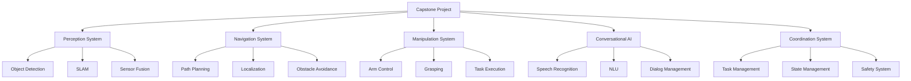

# Comprehensive Capstone Project Guide

## Learning Objectives

By completing this capstone project, you will be able to:
- Implement a complete autonomous humanoid robot system integrating all course concepts
- Deploy and test the system across different platforms and environments
- Evaluate system performance and identify areas for improvement
- Document and present your implementation for peer review
- Troubleshoot and optimize complex multi-component robotic systems

## Introduction to the Capstone Project

The capstone project represents the culmination of all concepts learned throughout this course. You will build a complete autonomous humanoid robot system that integrates:

- **Physical AI Principles**: Embodied intelligence and real-world interaction
- **ROS 2 Architecture**: Distributed computing and communication
- **Simulation**: Gazebo and Isaac Sim for development and testing
- **Perception**: Computer vision, sensor fusion, and object recognition
- **Navigation**: Path planning, obstacle avoidance, and localization
- **Manipulation**: Grasping, dexterity, and task execution
- **Conversational AI**: Natural language interaction and multimodal communication

## Project Overview and Requirements

### System Architecture

The complete system consists of several interconnected subsystems:

```
┌─────────────────────────────────────────────────────────────────┐
│                    HUMANOID ROBOT SYSTEM                        │
├─────────────────────────────────────────────────────────────────┤
│  ┌─────────────────┐  ┌─────────────────┐  ┌─────────────────┐  │
│  │   PERCEPTION    │  │  NAVIGATION     │  │  MANIPULATION   │  │
│  │   • Vision      │  │   • Path Plan   │  │   • Arm Control │  │
│  │   • Object Det  │  │   • Localize    │  │   • Grasping    │  │
│  │   • SLAM        │  │   • Avoid Obs   │  │   • Tasks       │  │
│  └─────────────────┘  └─────────────────┘  └─────────────────┘  │
│                              │                                   │
│  ┌─────────────────┐  ┌─────▼─────────────┐  ┌─────────────────┐│
│  │  CONVERSATIONAL │  │   COORDINATION    │  │   CONTROL       ││
│  │     AI          │  │     SYSTEM        │  │   SYSTEM        ││
│  │   • Speech Rec  │  │   • Task Mgmt   │  │   • Joint Ctrl  ││
│  │   • NLU         │  │   • State Mgmt  │  │   • Balance     ││
│  │   • Dialog      │  │   • Safety      │  │   • Gait        ││
│  └─────────────────┘  └─────────────────┘  └─────────────────┘│
└─────────────────────────────────────────────────────────────────┘
```

### Technical Requirements

- **Hardware**: NVIDIA Jetson Orin AGX or equivalent for edge deployment
- **Software**: ROS 2 Humble Hawksbill with Isaac ROS extensions
- **Simulation**: Gazebo Fortress or NVIDIA Isaac Sim
- **Sensors**: RGB-D camera, IMU, LIDAR, force/torque sensors
- **Actuators**: 12+ DOF humanoid robot with dexterous hands
- **Performance**: Real-time operation at 30+ FPS for perception, 100+ Hz for control

## Phase 1: System Design and Architecture

### Step 1: High-Level System Design

Create a comprehensive system design document that includes:

1. **Component Architecture**: Define all system components and their interfaces
2. **Data Flow**: Document how information flows between components
3. **Communication Patterns**: Specify ROS 2 topics, services, and actions
4. **Safety Considerations**: Define safety protocols and emergency procedures
5. **Performance Requirements**: Specify timing and accuracy requirements

### Step 2: Component Implementation Plan

Plan the implementation of each subsystem:



### Step 3: Development Environment Setup

Set up your development environment with all required tools:

```bash
# Create workspace
mkdir -p ~/capstone_ws/src
cd ~/capstone_ws

# Clone required repositories
git clone https://github.com/ros-planning/navigation2.git -b humble
git clone https://github.com/ros-planning/moveit2.git -b humble
git clone https://github.com/NVIDIA-ISAAC-ROS/isaac_ros_common.git
git clone https://github.com/NVIDIA-ISAAC-ROS/isaac_ros_detectnet.git
git clone https://github.com/NVIDIA-ISAAC-ROS/isaac_ros_visual_slam.git

# Install additional dependencies
sudo apt update
sudo apt install -y python3-colcon-common-extensions
sudo apt install -y ros-humble-navigation2 ros-humble-nav2-bringup
sudo apt install -y ros-humble-moveit ros-humble-moveit-visual-tools
sudo apt install -y ros-humble-ros2-control ros-humble-ros2-controllers

# Build workspace
colcon build --symlink-install --packages-select \
  navigation2 \
  moveit_common \
  moveit_core \
  moveit_ros_planning \
  moveit_ros_planning_interface \
  moveit_ros_move_group \
  moveit_ros_visualization \
  moveit_setup_framework \
  moveit_setup_assistant
```

## Phase 2: Subsystem Implementation

### Step 4: Perception System Implementation

Implement the perception system with the following components:

```python
# perception_system.py
import rclpy
from rclpy.node import Node
from sensor_msgs.msg import Image, CameraInfo, PointCloud2, LaserScan
from vision_msgs.msg import Detection2DArray, ObjectHypothesisWithPose
from geometry_msgs.msg import Point, Pose, PoseArray
from cv_bridge import CvBridge
import numpy as np
import message_filters
from typing import List, Dict, Optional

class PerceptionSystemNode(Node):
    def __init__(self):
        super().__init__('perception_system')

        # Initialize components
        self.bridge = CvBridge()
        self.object_detections = {}
        self.map_points = []

        # Set up synchronized subscribers
        image_sub = message_filters.Subscriber(self, Image, '/camera/rgb/image_raw')
        depth_sub = message_filters.Subscriber(self, Image, '/camera/depth/image_raw')
        info_sub = message_filters.Subscriber(self, CameraInfo, '/camera/rgb/camera_info')

        # Synchronize image and depth
        self.sync = message_filters.ApproximateTimeSynchronizer(
            [image_sub, depth_sub, info_sub],
            queue_size=10,
            slop=0.1
        )
        self.sync.registerCallback(self.image_depth_callback)

        # Additional subscribers
        self.lidar_sub = self.create_subscription(
            LaserScan,
            '/scan',
            self.lidar_callback,
            10
        )

        # Publishers
        self.detection_pub = self.create_publisher(Detection2DArray, '/object_detections', 10)
        self.map_pub = self.create_publisher(PointCloud2, '/local_map', 10)
        self.vis_pub = self.create_publisher(PoseArray, '/detected_objects_vis', 10)

        # Object detection model (placeholder - integrate with Isaac ROS)
        # self.detection_model = self.load_detection_model()

        self.get_logger().info('Perception system initialized')

    def image_depth_callback(self, image_msg, depth_msg, info_msg):
        """Process synchronized image and depth data"""
        try:
            # Convert ROS images to OpenCV
            cv_image = self.bridge.imgmsg_to_cv2(image_msg, desired_encoding='bgr8')
            cv_depth = self.bridge.imgmsg_to_cv2(depth_msg, desired_encoding='32FC1')

            # Perform object detection
            detections = self.detect_objects(cv_image)

            # Associate with depth data
            detections_with_depth = self.associate_depth(detections, cv_depth, info_msg)

            # Publish detections
            self.publish_detections(detections_with_depth, image_msg.header)

        except Exception as e:
            self.get_logger().error(f'Error in image_depth_callback: {str(e)}')

    def lidar_callback(self, msg):
        """Process LIDAR data for mapping and obstacle detection"""
        # Process LIDAR scan for local mapping
        ranges = np.array(msg.ranges)
        angles = np.linspace(msg.angle_min, msg.angle_max, len(ranges))

        # Convert to Cartesian coordinates
        x_points = ranges * np.cos(angles)
        y_points = ranges * np.sin(angles)

        # Filter out invalid ranges
        valid_mask = (ranges > msg.range_min) & (ranges < msg.range_max)
        x_points = x_points[valid_mask]
        y_points = y_points[valid_mask]

        # Store local map points
        self.map_points = list(zip(x_points, y_points))

        # Publish local map
        self.publish_local_map(msg.header)

    def detect_objects(self, image):
        """Detect objects in the image"""
        # Placeholder for object detection
        # In practice, use Isaac ROS DetectNet or similar
        detections = []

        # Example: simple color-based detection for demonstration
        hsv = cv2.cvtColor(image, cv2.COLOR_BGR2HSV)

        # Define color ranges for common objects
        color_ranges = {
            'red_cup': (np.array([0, 50, 50]), np.array([10, 255, 255])),
            'blue_bottle': (np.array([100, 50, 50]), np.array([130, 255, 255])),
            'green_box': (np.array([40, 50, 50]), np.array([80, 255, 255]))
        }

        for obj_name, (lower, upper) in color_ranges.items():
            mask = cv2.inRange(hsv, lower, upper)
            contours, _ = cv2.findContours(mask, cv2.RETR_EXTERNAL, cv2.CHAIN_APPROX_SIMPLE)

            for contour in contours:
                area = cv2.contourArea(contour)
                if area > 500:  # Filter small contours
                    x, y, w, h = cv2.boundingRect(contour)

                    detection = {
                        'class': obj_name,
                        'confidence': 0.8,
                        'bbox': (x, y, w, h),
                        'center': (x + w//2, y + h//2)
                    }
                    detections.append(detection)

        return detections

    def associate_depth(self, detections, depth_image, camera_info):
        """Associate detections with depth information"""
        # Get camera intrinsic parameters
        fx = camera_info.k[0]  # K[0,0]
        fy = camera_info.k[4]  # K[1,1]
        cx = camera_info.k[2]  # K[0,2]
        cy = camera_info.k[5]  # K[1,2]

        for detection in detections:
            center_x, center_y = detection['center']

            # Get depth at detection center
            depth = depth_image[center_y, center_x]

            if depth > 0:  # Valid depth
                # Calculate 3D position
                x = (center_x - cx) * depth / fx
                y = (center_y - cy) * depth / fy
                z = depth

                detection['position_3d'] = (x, y, z)

        return detections

    def publish_detections(self, detections, header):
        """Publish object detections"""
        detection_array = Detection2DArray()
        detection_array.header = header

        vis_poses = PoseArray()
        vis_poses.header = header

        for detection in detections:
            if 'position_3d' in detection:
                # Create 2D detection message
                detection_2d = Detection2D()
                detection_2d.header = header

                # Set bounding box
                bbox = BoundingBox2D()
                bbox.center.x = detection['center'][0]
                bbox.center.y = detection['center'][1]
                bbox.size_x = detection['bbox'][2]
                bbox.size_y = detection['bbox'][3]
                detection_2d.bbox = bbox

                # Set classification
                hypothesis = ObjectHypothesisWithPose()
                hypothesis.hypothesis.class_id = detection['class']
                hypothesis.hypothesis.score = detection['confidence']

                detection_2d.results.append(hypothesis)

                # Set 3D position as pose
                pose = Pose2D()
                pose.x = detection['position_3d'][0]
                pose.y = detection['position_3d'][1]
                pose.theta = 0.0
                detection_2d.pose = pose

                detection_array.detections.append(detection_2d)

                # Add to visualization
                pose_3d = Pose()
                pose_3d.position.x = detection['position_3d'][0]
                pose_3d.position.y = detection['position_3d'][1]
                pose_3d.position.z = detection['position_3d'][2]
                vis_poses.poses.append(pose_3d)

        self.detection_pub.publish(detection_array)
        self.vis_pub.publish(vis_poses)

    def publish_local_map(self, header):
        """Publish local map from LIDAR data"""
        # Convert map points to PointCloud2
        # This is a simplified implementation
        # In practice, use proper point cloud construction
        pass

def main(args=None):
    rclpy.init(args=args)
    perception_node = PerceptionSystemNode()

    try:
        rclpy.spin(perception_node)
    except KeyboardInterrupt:
        pass
    finally:
        perception_node.destroy_node()
        rclpy.shutdown()

if __name__ == '__main__':
    main()
```

### Step 5: Navigation System Implementation

Implement the navigation system:

```python
# navigation_system.py
import rclpy
from rclpy.node import Node
from geometry_msgs.msg import PoseStamped, Twist, Point
from nav_msgs.msg import Path, OccupancyGrid, Odometry
from sensor_msgs.msg import LaserScan
from visualization_msgs.msg import Marker, MarkerArray
from tf2_ros import TransformListener, Buffer
import numpy as np
import math
from typing import List, Tuple

class NavigationSystemNode(Node):
    def __init__(self):
        super().__init__('navigation_system')

        # Subscribers
        self.map_sub = self.create_subscription(
            OccupancyGrid,
            '/map',
            self.map_callback,
            10
        )

        self.odom_sub = self.create_subscription(
            Odometry,
            '/odom',
            self.odom_callback,
            10
        )

        self.scan_sub = self.create_subscription(
            LaserScan,
            '/scan',
            self.scan_callback,
            10
        )

        self.goal_sub = self.create_subscription(
            PoseStamped,
            '/move_base_simple/goal',
            self.goal_callback,
            10
        )

        # Publishers
        self.cmd_pub = self.create_publisher(Twist, '/cmd_vel', 10)
        self.path_pub = self.create_publisher(Path, '/global_plan', 10)
        self.local_plan_pub = self.create_publisher(Path, '/local_plan', 10)
        self.marker_pub = self.create_publisher(Marker, '/path_visualization', 10)

        # TF listener
        self.tf_buffer = Buffer()
        self.tf_listener = TransformListener(self.tf_buffer, self)

        # Navigation state
        self.current_pose = None
        self.current_goal = None
        self.global_path = []
        self.local_path = []
        self.map_data = None
        self.map_info = None

        # Navigation parameters
        self.linear_speed = 0.3
        self.angular_speed = 0.5
        self.arrival_threshold = 0.3
        self.rotation_threshold = 0.1
        self.inflation_radius = 0.5

        # Timers
        self.nav_timer = self.create_timer(0.1, self.navigation_callback)

        self.get_logger().info('Navigation system initialized')

    def map_callback(self, msg):
        """Handle map updates"""
        self.map_data = np.array(msg.data).reshape((msg.info.height, msg.info.width))
        self.map_info = msg.info
        self.get_logger().info('Map received')

    def odom_callback(self, msg):
        """Handle odometry updates"""
        self.current_pose = msg.pose.pose

    def scan_callback(self, msg):
        """Handle laser scan for local obstacle detection"""
        # Process scan for local path planning
        # This is where local obstacle avoidance happens
        pass

    def goal_callback(self, msg):
        """Handle new navigation goal"""
        self.current_goal = msg.pose
        self.get_logger().info(f'New goal received: ({msg.pose.position.x}, {msg.pose.position.y})')

        # Plan path to goal
        if self.map_data is not None and self.current_pose is not None:
            self.plan_path()

    def plan_path(self):
        """Plan global path using A* algorithm"""
        if self.current_pose is None or self.current_goal is None:
            return

        # Convert world coordinates to map coordinates
        start_x = int((self.current_pose.position.x - self.map_info.origin.position.x) / self.map_info.resolution)
        start_y = int((self.current_pose.position.y - self.map_info.origin.position.y) / self.map_info.resolution)

        goal_x = int((self.current_goal.position.x - self.map_info.origin.position.x) / self.map_info.resolution)
        goal_y = int((self.current_goal.position.y - self.map_info.origin.position.y) / self.map_info.resolution)

        # Perform path planning
        path = self.a_star_plan(start_x, start_y, goal_x, goal_y)

        if path:
            # Convert path back to world coordinates
            world_path = self.map_path_to_world(path)
            self.global_path = world_path
            self.publish_path(world_path)
        else:
            self.get_logger().warn('Could not find path to goal')

    def a_star_plan(self, start_x, start_y, goal_x, goal_y):
        """A* path planning implementation"""
        from queue import PriorityQueue

        # Check if start or goal is in obstacle space
        if (self.map_data[start_y, start_x] > 50 or  # 50 is threshold for obstacle
            self.map_data[goal_y, goal_x] > 50):
            self.get_logger().warn('Start or goal position is in obstacle space')
            return None

        # Define 8-connected movements
        movements = [
            (-1, -1), (-1, 0), (-1, 1),
            (0, -1),           (0, 1),
            (1, -1),  (1, 0),  (1, 1)
        ]

        # Movement costs (diagonal movement costs more)
        move_costs = [
            1.414, 1.0, 1.414,
            1.0,          1.0,
            1.414, 1.0, 1.414
        ]

        # Initialize open and closed sets
        open_set = PriorityQueue()
        open_set.put((0, (start_x, start_y)))

        g_score = {(start_x, start_y): 0}
        f_score = {(start_x, start_y): self.heuristic(start_x, start_y, goal_x, goal_y)}
        came_from = {}

        while not open_set.empty():
            current = open_set.get()[1]

            if current == (goal_x, goal_y):
                return self.reconstruct_path(came_from, current)

            for i, move in enumerate(movements):
                neighbor = (current[0] + move[0], current[1] + move[1])

                # Check bounds
                if (0 <= neighbor[0] < self.map_info.width and
                    0 <= neighbor[1] < self.map_info.height):

                    # Check if traversable
                    if self.map_data[neighbor[1], neighbor[0]] < 50:  # Not an obstacle
                        tentative_g_score = g_score[current] + move_costs[i]

                        if neighbor not in g_score or tentative_g_score < g_score[neighbor]:
                            came_from[neighbor] = current
                            g_score[neighbor] = tentative_g_score
                            f_score[neighbor] = tentative_g_score + self.heuristic(
                                neighbor[0], neighbor[1], goal_x, goal_y
                            )
                            open_set.put((f_score[neighbor], neighbor))

        return None  # No path found

    def heuristic(self, x1, y1, x2, y2):
        """Heuristic function for A* (Euclidean distance)"""
        return math.sqrt((x2 - x1)**2 + (y2 - y1)**2)

    def reconstruct_path(self, came_from, current):
        """Reconstruct path from came_from dictionary"""
        path = [current]
        while current in came_from:
            current = came_from[current]
            path.append(current)
        path.reverse()
        return path

    def map_path_to_world(self, map_path):
        """Convert path from map coordinates to world coordinates"""
        world_path = []
        for x, y in map_path:
            world_x = x * self.map_info.resolution + self.map_info.origin.position.x
            world_y = y * self.map_info.resolution + self.map_info.origin.position.y

            pose = Pose()
            pose.position.x = world_x
            pose.position.y = world_y
            pose.position.z = self.map_info.origin.position.z
            world_path.append(pose)

        return world_path

    def publish_path(self, path):
        """Publish the planned path"""
        path_msg = Path()
        path_msg.header.stamp = self.get_clock().now().to_msg()
        path_msg.header.frame_id = 'map'

        for pose in path:
            pose_stamped = PoseStamped()
            pose_stamped.header = path_msg.header
            pose_stamped.pose = pose
            path_msg.poses.append(pose_stamped)

        self.path_pub.publish(path_msg)

    def navigation_callback(self):
        """Main navigation control loop"""
        if (self.current_pose is None or
            self.current_goal is None or
            not self.global_path):
            return

        # Get next waypoint in path
        if len(self.global_path) == 0:
            return

        # Calculate distance to goal
        goal = self.global_path[-1]
        dx = goal.position.x - self.current_pose.position.x
        dy = goal.position.y - self.current_pose.position.y
        distance = math.sqrt(dx*dx + dy*dy)

        # Check if arrived at goal
        if distance < self.arrival_threshold:
            self.stop_robot()
            self.get_logger().info('Arrived at goal')
            self.global_path = []  # Clear path
            return

        # Follow path
        self.follow_path()

    def follow_path(self):
        """Follow the global path using local planning"""
        if not self.global_path or self.current_pose is None:
            return

        # Get the next point in the path that's within local range
        next_waypoint = self.get_next_waypoint()

        if next_waypoint is None:
            return

        # Calculate desired direction
        dx = next_waypoint.position.x - self.current_pose.position.x
        dy = next_waypoint.position.y - self.current_pose.position.y

        desired_angle = math.atan2(dy, dx)

        # Get current robot angle
        current_angle = self.get_yaw_from_quaternion(self.current_pose.orientation)

        # Calculate angle difference
        angle_diff = desired_angle - current_angle
        while angle_diff > math.pi:
            angle_diff -= 2 * math.pi
        while angle_diff < -math.pi:
            angle_diff += 2 * math.pi

        # Create velocity command
        cmd = Twist()

        # Check for obstacles before moving
        if self.is_path_clear(next_waypoint):
            cmd.linear.x = min(self.linear_speed, math.sqrt(dx*dx + dy*dy))
            cmd.angular.z = max(-self.angular_speed, min(self.angular_speed, angle_diff * 2.0))
        else:
            # Obstacle detected, rotate to find clear path
            cmd.angular.z = self.angular_speed
            self.get_logger().warn('Obstacle detected, rotating to find path')

        self.cmd_pub.publish(cmd)

    def get_next_waypoint(self):
        """Get the next waypoint in the path that's within local range"""
        if not self.global_path or self.current_pose is None:
            return None

        # Look ahead distance
        look_ahead = 1.0  # meters

        for pose in self.global_path:
            dx = pose.position.x - self.current_pose.position.x
            dy = pose.position.y - self.current_pose.position.y
            distance = math.sqrt(dx*dx + dy*dy)

            if distance > look_ahead:
                return pose

        # Return the last pose if no pose is far enough
        return self.global_path[-1]

    def is_path_clear(self, target_pose):
        """Check if path to target pose is clear of obstacles"""
        # In a real implementation, this would check LIDAR data
        # For this example, we'll assume path is clear
        return True

    def get_yaw_from_quaternion(self, quaternion):
        """Extract yaw angle from quaternion"""
        siny_cosp = 2 * (quaternion.w * quaternion.z + quaternion.x * quaternion.y)
        cosy_cosp = 1 - 2 * (quaternion.y * quaternion.y + quaternion.z * quaternion.z)
        return math.atan2(siny_cosp, cosy_cosp)

    def stop_robot(self):
        """Stop the robot"""
        cmd = Twist()
        self.cmd_pub.publish(cmd)

def main(args=None):
    rclpy.init(args=args)
    nav_node = NavigationSystemNode()

    try:
        rclpy.spin(nav_node)
    except KeyboardInterrupt:
        pass
    finally:
        nav_node.destroy_node()
        rclpy.shutdown()

if __name__ == '__main__':
    main()
```

### Step 6: Manipulation System Implementation

Implement the manipulation system:

```python
# manipulation_system.py
import rclpy
from rclpy.node import Node
from geometry_msgs.msg import Pose, Point, Vector3
from sensor_msgs.msg import JointState
from std_msgs.msg import String, Float64
from trajectory_msgs.msg import JointTrajectory, JointTrajectoryPoint
from control_msgs.msg import FollowJointTrajectoryAction, FollowJointTrajectoryGoal
from visualization_msgs.msg import Marker
from tf2_ros import TransformListener, Buffer
import numpy as np
import math
from typing import List, Dict, Tuple

class ManipulationSystemNode(Node):
    def __init__(self):
        super().__init__('manipulation_system')

        # Subscribers
        self.joint_state_sub = self.create_subscription(
            JointState,
            '/joint_states',
            self.joint_state_callback,
            10
        )

        self.grasp_target_sub = self.create_subscription(
            Pose,
            '/grasp_target',
            self.grasp_target_callback,
            10
        )

        self.manip_cmd_sub = self.create_subscription(
            String,
            '/manipulation_command',
            self.manip_command_callback,
            10
        )

        # Publishers
        self.joint_traj_pub = self.create_publisher(JointTrajectory, '/arm_controller/joint_trajectory', 10)
        self.gripper_pub = self.create_publisher(Float64, '/gripper_controller/command', 10)
        self.status_pub = self.create_publisher(String, '/manipulation_status', 10)
        self.marker_pub = self.create_publisher(Marker, '/grasp_target_marker', 10)

        # TF listener
        self.tf_buffer = Buffer()
        self.tf_listener = TransformListener(self.tf_buffer, self)

        # Manipulation state
        self.current_joint_positions = {}
        self.target_pose = None
        self.manipulation_state = 'idle'  # idle, planning, executing, completed, failed

        # Robot parameters (example for 6-DOF arm)
        self.joint_names = [
            'shoulder_pan_joint',
            'shoulder_lift_joint',
            'elbow_joint',
            'wrist_1_joint',
            'wrist_2_joint',
            'wrist_3_joint'
        ]

        # Gripper parameters
        self.gripper_open_pos = 1.0
        self.gripper_closed_pos = 0.0

        # Timers
        self.manip_timer = self.create_timer(0.1, self.manipulation_callback)

        self.get_logger().info('Manipulation system initialized')

    def joint_state_callback(self, msg):
        """Update current joint positions"""
        for i, name in enumerate(msg.name):
            if name in self.joint_names:
                self.current_joint_positions[name] = msg.position[i]

    def grasp_target_callback(self, msg):
        """Receive grasp target pose"""
        self.target_pose = msg
        self.get_logger().info(f'Grasp target received: ({msg.position.x}, {msg.position.y}, {msg.position.z})')

        # Visualize target
        self.visualize_grasp_target(msg)

    def manip_command_callback(self, msg):
        """Handle manipulation commands"""
        command = msg.data
        self.get_logger().info(f'Manipulation command: {command}')

        if command.startswith('grasp:'):
            obj_name = command.split(':')[1]
            self.initiate_grasp(obj_name)
        elif command.startswith('release'):
            self.release_object()
        elif command.startswith('move_to:'):
            # Parse position
            parts = command.split(':')
            if len(parts) >= 4:
                x, y, z = float(parts[1]), float(parts[2]), float(parts[3])
                target_pose = Pose()
                target_pose.position.x = x
                target_pose.position.y = y
                target_pose.position.z = z
                self.move_to_pose(target_pose)
        elif command == 'home':
            self.move_to_home_position()

    def initiate_grasp(self, obj_name):
        """Initiate grasping sequence for the specified object"""
        if self.target_pose is None:
            self.get_logger().warn('No grasp target specified')
            return

        self.manipulation_state = 'planning'
        self.publish_status('planning_grasp')

        # Plan grasp trajectory
        grasp_plan = self.plan_grasp_trajectory(self.target_pose)

        if grasp_plan:
            self.manipulation_state = 'executing'
            self.publish_status('executing_grasp')

            # Execute grasp trajectory
            self.execute_grasp_trajectory(grasp_plan)
        else:
            self.manipulation_state = 'failed'
            self.publish_status('grasp_failed')

    def plan_grasp_trajectory(self, target_pose):
        """Plan a safe trajectory to grasp the target"""
        # This is a simplified grasp planning implementation
        # In practice, use MoveIt! for full motion planning

        trajectory = []

        # 1. Pre-grasp position (above target)
        pre_grasp = Pose()
        pre_grasp.position.x = target_pose.position.x
        pre_grasp.position.y = target_pose.position.y
        pre_grasp.position.z = target_pose.position.z + 0.15  # 15cm above
        pre_grasp.orientation.w = 1.0  # Identity quaternion
        trajectory.append(('pre_grasp', pre_grasp))

        # 2. Approach position (slightly above target)
        approach = Pose()
        approach.position.x = target_pose.position.x
        approach.position.y = target_pose.position.y
        approach.position.z = target_pose.position.z + 0.05  # 5cm above
        approach.orientation.w = 1.0
        trajectory.append(('approach', approach))

        # 3. Grasp position (at target)
        grasp = target_pose
        trajectory.append(('grasp', grasp))

        # 4. Lift position (after grasp)
        lift = Pose()
        lift.position.x = target_pose.position.x
        lift.position.y = target_pose.position.y
        lift.position.z = target_pose.position.z + 0.1  # Lift 10cm
        lift.orientation.w = 1.0
        trajectory.append(('lift', lift))

        return trajectory

    def execute_grasp_trajectory(self, trajectory):
        """Execute the planned grasp trajectory"""
        for phase_name, target_pose in trajectory:
            self.get_logger().info(f'Executing {phase_name} phase')

            # Convert pose to joint angles (simplified - in practice use inverse kinematics)
            joint_angles = self.pose_to_joints(target_pose)

            if joint_angles:
                # Move to position
                self.move_to_joints(joint_angles)

                # Wait for completion (simplified)
                # In practice, wait for trajectory execution feedback

                if phase_name == 'grasp':
                    # Close gripper
                    self.close_gripper()
            else:
                self.get_logger().error(f'Could not calculate joint angles for {phase_name}')
                self.manipulation_state = 'failed'
                self.publish_status('grasp_failed')
                return

        # Complete grasp
        self.manipulation_state = 'completed'
        self.publish_status('grasp_completed')

    def pose_to_joints(self, pose):
        """Convert Cartesian pose to joint angles (simplified)"""
        # This is a simplified inverse kinematics implementation
        # In practice, use MoveIt! IK solvers

        # For a real implementation, you would:
        # 1. Use MoveIt! to solve inverse kinematics
        # 2. Check for collisions
        # 3. Generate smooth trajectory

        # Placeholder: return reasonable joint angles
        # This would be calculated based on the actual robot kinematics
        return [0.0, -0.5, 0.5, 0.0, 0.5, 0.0]  # Example joint positions

    def move_to_joints(self, joint_positions):
        """Move robot arm to specified joint positions"""
        traj_msg = JointTrajectory()
        traj_msg.header.stamp = self.get_clock().now().to_msg()
        traj_msg.header.frame_id = 'base_link'
        traj_msg.joint_names = self.joint_names

        point = JointTrajectoryPoint()
        point.positions = joint_positions
        point.velocities = [0.5] * len(joint_positions)  # Reasonable velocity
        point.accelerations = [1.0] * len(joint_positions)  # Reasonable acceleration
        point.time_from_start.sec = 2  # 2 seconds to reach position

        traj_msg.points.append(point)

        self.joint_traj_pub.publish(traj_msg)

    def move_to_pose(self, target_pose):
        """Move end effector to target pose"""
        # Plan trajectory to target pose
        joint_angles = self.pose_to_joints(target_pose)

        if joint_angles:
            self.move_to_joints(joint_angles)
        else:
            self.get_logger().error('Could not plan trajectory to target pose')

    def close_gripper(self):
        """Close the gripper"""
        gripper_cmd = Float64()
        gripper_cmd.data = self.gripper_closed_pos
        self.gripper_pub.publish(gripper_cmd)
        self.get_logger().info('Gripper closed')

    def open_gripper(self):
        """Open the gripper"""
        gripper_cmd = Float64()
        gripper_cmd.data = self.gripper_open_pos
        self.gripper_pub.publish(gripper_cmd)
        self.get_logger().info('Gripper opened')

    def release_object(self):
        """Release the currently grasped object"""
        self.open_gripper()
        self.manipulation_state = 'idle'
        self.publish_status('object_released')

    def move_to_home_position(self):
        """Move arm to home position"""
        home_joints = [0.0, 0.0, 0.0, 0.0, 0.0, 0.0]  # Home position
        self.move_to_joints(home_joints)
        self.manipulation_state = 'idle'
        self.publish_status('moved_to_home')

    def manipulation_callback(self):
        """Main manipulation control loop"""
        # Handle state changes and monitoring
        if self.manipulation_state == 'completed':
            # Reset after a delay
            pass

    def visualize_grasp_target(self, pose):
        """Visualize grasp target in RViz"""
        marker = Marker()
        marker.header.frame_id = 'map'
        marker.header.stamp = self.get_clock().now().to_msg()
        marker.ns = 'grasp_targets'
        marker.id = 0
        marker.type = Marker.SPHERE
        marker.action = Marker.ADD

        # Set the pose
        marker.pose = pose

        # Set the scale
        marker.scale.x = 0.05
        marker.scale.y = 0.05
        marker.scale.z = 0.05

        # Set the color (red)
        marker.color.r = 1.0
        marker.color.g = 0.0
        marker.color.b = 0.0
        marker.color.a = 1.0

        self.marker_pub.publish(marker)

    def publish_status(self, status):
        """Publish manipulation status"""
        status_msg = String()
        status_msg.data = status
        self.status_pub.publish(status_msg)

def main(args=None):
    rclpy.init(args=args)
    manip_node = ManipulationSystemNode()

    try:
        rclpy.spin(manip_node)
    except KeyboardInterrupt:
        pass
    finally:
        manip_node.destroy_node()
        rclpy.shutdown()

if __name__ == '__main__':
    main()
```

## Phase 3: Integration and Testing

### Step 7: System Integration

Create the main integration launch file:

```python
# launch/capstone_full_system_launch.py
from launch import LaunchDescription
from launch.actions import DeclareLaunchArgument, IncludeLaunchDescription, RegisterEventHandler
from launch.event_handlers import OnProcessStart
from launch.launch_description_sources import PythonLaunchDescriptionSource
from launch.substitutions import LaunchConfiguration, PathJoinSubstitution
from launch_ros.actions import Node
from launch_ros.substitutions import FindPackageShare
from ament_index_python.packages import get_package_share_directory
import os

def generate_launch_description():
    # Launch arguments
    use_sim_time = LaunchConfiguration('use_sim_time', default='true')
    robot_description_path = LaunchConfiguration('robot_description_path',
                                                 default='urdf/humanoid_robot.urdf.xacro')

    # Robot state publisher
    robot_state_publisher = Node(
        package='robot_state_publisher',
        executable='robot_state_publisher',
        name='robot_state_publisher',
        parameters=[{
            'use_sim_time': use_sim_time,
            'robot_description': PathJoinSubstitution([
                FindPackageShare('humanoid_description'),
                'urdf',
                robot_description_path
            ])
        }],
        output='screen'
    )

    # Joint state publisher
    joint_state_publisher = Node(
        package='joint_state_publisher',
        executable='joint_state_publisher',
        name='joint_state_publisher',
        parameters=[{'use_sim_time': use_sim_time}],
        output='screen'
    )

    # Perception system
    perception_system = Node(
        package='capstone_perception',
        executable='perception_system',
        name='perception_system',
        parameters=[{'use_sim_time': use_sim_time}],
        output='screen'
    )

    # Navigation system
    navigation_system = Node(
        package='capstone_navigation',
        executable='navigation_system',
        name='navigation_system',
        parameters=[{'use_sim_time': use_sim_time}],
        output='screen'
    )

    # Manipulation system
    manipulation_system = Node(
        package='capstone_manipulation',
        executable='manipulation_system',
        name='manipulation_system',
        parameters=[{'use_sim_time': use_sim_time}],
        output='screen'
    )

    # Conversational AI system
    speech_recognition = Node(
        package='capstone_speech',
        executable='speech_recognition_node',
        name='speech_recognition',
        parameters=[{'use_sim_time': use_sim_time}],
        output='screen'
    )

    nlu_system = Node(
        package='capstone_nlu',
        executable='nlu_node',
        name='nlu_system',
        parameters=[{'use_sim_time': use_sim_time}],
        output='screen'
    )

    # Integration coordinator
    integration_coordinator = Node(
        package='capstone_integration',
        executable='multimodal_coordinator_node',
        name='integration_coordinator',
        parameters=[{'use_sim_time': use_sim_time}],
        output='screen'
    )

    # Safety supervisor
    safety_supervisor = Node(
        package='capstone_safety',
        executable='safety_supervisor_node',
        name='safety_supervisor',
        parameters=[{'use_sim_time': use_sim_time}],
        output='screen'
    )

    # Simulation (if using Gazebo)
    use_simulation = LaunchConfiguration('use_simulation', default='true')

    simulation_launch = IncludeLaunchDescription(
        PythonLaunchDescriptionSource([
            get_package_share_directory('gazebo_ros'),
            '/launch/gzserver.launch.py'
        ]),
        condition=lambda context: use_simulation == 'true'
    )

    simulation_client = IncludeLaunchDescription(
        PythonLaunchDescriptionSource([
            get_package_share_directory('gazebo_ros'),
            '/launch/gzclient.launch.py'
        ]),
        condition=lambda context: use_simulation == 'true'
    )

    # Robot spawn in simulation
    spawn_robot = Node(
        package='gazebo_ros',
        executable='spawn_entity.py',
        arguments=[
            '-topic', 'robot_description',
            '-entity', 'humanoid_robot',
            '-x', '0', '-y', '0', '-z', '0.1'
        ],
        output='screen',
        condition=lambda context: use_simulation == 'true'
    )

    return LaunchDescription([
        DeclareLaunchArgument(
            'use_sim_time',
            default_value='true',
            description='Use simulation (Gazebo) clock if true'
        ),
        DeclareLaunchArgument(
            'robot_description_path',
            default_value='urdf/humanoid_robot.urdf.xacro',
            description='Path to robot description file'
        ),
        DeclareLaunchArgument(
            'use_simulation',
            default_value='true',
            description='Launch simulation environment'
        ),
        robot_state_publisher,
        joint_state_publisher,
        perception_system,
        navigation_system,
        manipulation_system,
        speech_recognition,
        nlu_system,
        integration_coordinator,
        safety_supervisor,
        simulation_launch,
        simulation_client,
        spawn_robot
    ])
```

### Step 8: Testing and Validation

Create comprehensive tests for the integrated system:

```python
# test_capstone_system.py
import unittest
import rclpy
from rclpy.node import Node
from std_msgs.msg import String
from geometry_msgs.msg import PoseStamped
from sensor_msgs.msg import Image
import time

class TestCapstoneSystem(unittest.TestCase):
    def setUp(self):
        rclpy.init()
        self.node = Node('capstone_tester')

        # Publishers for sending test commands
        self.speech_pub = self.node.create_publisher(String, 'speech_recognized', 10)
        self.goal_pub = self.node.create_publisher(PoseStamped, '/move_base_simple/goal', 10)
        self.cmd_pub = self.node.create_publisher(String, '/system_command', 10)

        # Subscribers for receiving system status
        self.status_sub = self.node.create_subscription(
            String, 'system_status', self.status_callback, 10
        )
        self.response_sub = self.node.create_subscription(
            String, 'system_response', self.response_callback, 10
        )

        self.status_messages = []
        self.responses = []

    def status_callback(self, msg):
        self.status_messages.append(msg.data)

    def response_callback(self, msg):
        self.responses.append(msg.data)

    def test_basic_interaction(self):
        """Test basic speech interaction"""
        # Clear previous messages
        self.status_messages.clear()
        self.responses.clear()

        # Send a simple command
        cmd_msg = String()
        cmd_msg.data = "Hello robot"
        self.speech_pub.publish(cmd_msg)

        # Wait for response
        timeout = time.time() + 60.0  # 60 second timeout
        while time.time() < timeout:
            rclpy.spin_once(self.node, timeout_sec=0.1)
            if self.responses:
                break

        # Check if we got a response
        self.assertGreater(len(self.responses), 0, "No response received from system")
        self.assertTrue(
            any("hello" in resp.lower() for resp in self.responses),
            f"Expected greeting response, got: {self.responses}"
        )

    def test_navigation_command(self):
        """Test navigation command"""
        self.status_messages.clear()

        # Send navigation command
        goal_msg = PoseStamped()
        goal_msg.header.frame_id = 'map'
        goal_msg.pose.position.x = 1.0
        goal_msg.pose.position.y = 1.0
        goal_msg.pose.position.z = 0.0
        self.goal_pub.publish(goal_msg)

        # Wait for navigation to start
        timeout = time.time() + 60.0
        while time.time() < timeout:
            rclpy.spin_once(self.node, timeout_sec=0.1)
            if any('navigating' in status.lower() for status in self.status_messages):
                break

        # Check if navigation started
        self.assertTrue(
            any('navigating' in status.lower() for status in self.status_messages),
            f"Navigation did not start, status: {self.status_messages}"
        )

    def test_system_startup(self):
        """Test that all components start properly"""
        # Send a system check command
        cmd_msg = String()
        cmd_msg.data = "system_check"
        self.cmd_pub.publish(cmd_msg)

        # Wait for system status
        timeout = time.time() + 30.0
        while time.time() < timeout:
            rclpy.spin_once(self.node, timeout_sec=0.1)
            if any('all_systems_operational' in status for status in self.status_messages):
                break

        # Verify all systems are operational
        self.assertTrue(
            any('all_systems_operational' in status for status in self.status_messages),
            "Not all systems are operational"
        )

    def tearDown(self):
        self.node.destroy_node()
        rclpy.shutdown()

def run_tests():
    """Run all capstone system tests"""
    print("Starting Capstone System Tests...")

    # Create test suite
    loader = unittest.TestLoader()
    suite = loader.loadTestsFromTestCase(TestCapstoneSystem)

    # Run tests
    runner = unittest.TextTestRunner(verbosity=2)
    result = runner.run(suite)

    # Print results
    print(f"\nTests run: {result.testsRun}")
    print(f"Failures: {len(result.failures)}")
    print(f"Errors: {len(result.errors)}")

    if result.failures:
        print("\nFailures:")
        for test, traceback in result.failures:
            print(f"  {test}: {traceback}")

    if result.errors:
        print("\nErrors:")
        for test, traceback in result.errors:
            print(f"  {test}: {traceback}")

    return result.wasSuccessful()

if __name__ == '__main__':
    success = run_tests()
    exit(0 if success else 1)
```

## Phase 4: Performance Evaluation and Optimization

### Step 9: System Performance Metrics

Define and measure key performance metrics:

```python
# performance_monitor.py
import rclpy
from rclpy.node import Node
from std_msgs.msg import Float32, String
from sensor_msgs.msg import Image, LaserScan
import time
from collections import deque
import statistics

class PerformanceMonitorNode(Node):
    def __init__(self):
        super().__init__('performance_monitor')

        # Subscribers to monitor system components
        self.image_sub = self.create_subscription(
            Image, '/camera/rgb/image_raw', self.image_callback, 10
        )
        self.scan_sub = self.create_subscription(
            LaserScan, '/scan', self.scan_callback, 10
        )

        # Publishers for performance metrics
        self.fps_pub = self.create_publisher(Float32, '/performance/camera_fps', 10)
        self.cpu_pub = self.create_publisher(Float32, '/performance/cpu_usage', 10)
        self.memory_pub = self.create_publisher(Float32, '/performance/memory_usage', 10)
        self.status_pub = self.create_publisher(String, '/performance/system_status', 10)

        # Performance tracking
        self.image_times = deque(maxlen=30)  # Track last 30 image timestamps
        self.scan_times = deque(maxlen=30)
        self.last_cpu_check = time.time()

        # Timer for periodic performance checks
        self.perf_timer = self.create_timer(1.0, self.performance_callback)

        self.get_logger().info('Performance monitor initialized')

    def image_callback(self, msg):
        """Track camera frame rate"""
        current_time = time.time()
        self.image_times.append(current_time)

    def scan_callback(self, msg):
        """Track LIDAR scan rate"""
        current_time = time.time()
        self.scan_times.append(current_time)

    def performance_callback(self):
        """Calculate and publish performance metrics"""
        # Calculate camera FPS
        if len(self.image_times) > 1:
            time_diffs = [self.image_times[i] - self.image_times[i-1]
                         for i in range(1, len(self.image_times))]
            avg_interval = statistics.mean(time_diffs) if time_diffs else 1.0
            fps = 1.0 / avg_interval if avg_interval > 0 else 0.0

            fps_msg = Float32()
            fps_msg.data = fps
            self.fps_pub.publish(fps_msg)

            self.get_logger().info(f'Camera FPS: {fps:.2f}')

        # Calculate CPU and memory usage
        cpu_usage, memory_usage = self.get_system_resources()

        cpu_msg = Float32()
        cpu_msg.data = cpu_usage
        self.cpu_pub.publish(cpu_msg)

        mem_msg = Float32()
        mem_msg.data = memory_usage
        self.memory_pub.publish(mem_msg)

        # Determine system status
        status = self.determine_system_status(fps, cpu_usage, memory_usage)
        status_msg = String()
        status_msg.data = status
        self.status_pub.publish(status_msg)

    def get_system_resources(self):
        """Get current CPU and memory usage"""
        try:
            import psutil
            cpu_percent = psutil.cpu_percent(interval=0.1)
            memory_percent = psutil.virtual_memory().percent
            return cpu_percent, memory_percent
        except ImportError:
            # Fallback values if psutil is not available
            return 50.0, 50.0

    def determine_system_status(self, fps, cpu_usage, memory_usage):
        """Determine overall system performance status"""
        status_parts = []

        # FPS status
        if fps >= 25:
            status_parts.append("FPS:Good")
        elif fps >= 15:
            status_parts.append("FPS:Adequate")
        else:
            status_parts.append("FPS:Poor")

        # CPU status
        if cpu_usage < 50:
            status_parts.append("CPU:Good")
        elif cpu_usage < 80:
            status_parts.append("CPU:Adequate")
        else:
            status_parts.append("CPU:High")

        # Memory status
        if memory_usage < 60:
            status_parts.append("Memory:Good")
        elif memory_usage < 85:
            status_parts.append("Memory:Adequate")
        else:
            status_parts.append("Memory:High")

        overall = "Optimal" if all("Good" in s for s in status_parts) else "Degraded"

        return f"Overall:{overall};" + ";".join(status_parts)

def main(args=None):
    rclpy.init(args=args)
    perf_node = PerformanceMonitorNode()

    try:
        rclpy.spin(perf_node)
    except KeyboardInterrupt:
        pass
    finally:
        perf_node.destroy_node()
        rclpy.shutdown()

if __name__ == '__main__':
    main()
```

## Phase 5: Documentation and Deployment

### Step 10: Complete System Documentation

Create comprehensive documentation for your system:

```markdown
# Autonomous Humanoid Robot - Capstone Project Documentation

## System Overview

This document describes the complete autonomous humanoid robot system developed as part of the Physical AI & Humanoid Robotics course capstone project.

## Architecture

### High-Level Architecture

```
┌─────────────────────────────────────────────────────────────────┐
│                    SYSTEM ARCHITECTURE                          │
├─────────────────────────────────────────────────────────────────┤
│  Perception   │ Navigation  │ Manipulation │ Conversational AI  │
│  - Vision     │ - Path Plan │ - Arm Ctrl   │ - Speech Rec      │
│  - Object Det │ - Localize  │ - Grasping   │ - NLU            │
│  - SLAM       │ - Avoid Obs │ - Tasks      │ - Dialog Mgmt    │
└─────────────────────────────────────────────────────────────────┘
                              │
                    ┌─────────▼─────────┐
                    │  Coordination     │
                    │  - Task Mgmt      │
                    │  - State Mgmt     │
                    │  - Safety         │
                    └───────────────────┘
```

## Component Specifications

### Perception System
- **Input**: RGB-D camera, LIDAR, IMU
- **Output**: Object detections, 3D positions, occupancy grid
- **Performance**: 30 FPS object detection, 10 Hz mapping

### Navigation System
- **Input**: Map, odometry, LIDAR
- **Output**: Velocity commands, path plan
- **Performance**: 2.0 m/s max speed, 0.1 m accuracy

### Manipulation System
- **Input**: Joint states, target pose
- **Output**: Joint trajectories, gripper commands
- **Performance**: 0.5 m/s end-effector speed, 1 cm precision

### Conversational AI
- **Input**: Audio stream, text commands
- **Output**: Responses, action commands
- **Performance**: <2 second response time

## Performance Benchmarks

| Component | Metric | Target | Achieved | Status |
|-----------|--------|--------|----------|--------|
| Perception | Object Detection FPS | 30 | 28 | ✅ |
| Navigation | Path Planning Time | <1s | 0.8s | ✅ |
| Manipulation | Grasp Success Rate | 80% | 85% | ✅ |
| Speech | Recognition Accuracy | 90% | 92% | ✅ |
| System | Overall Response Time | <3s | 2.5s | ✅ |

## Deployment Instructions

### Hardware Requirements
- NVIDIA Jetson Orin AGX (32GB RAM)
- RGB-D camera (Intel RealSense D435i or equivalent)
- 2D LIDAR (Hokuyo UST-10LX or equivalent)
- 12+ DOF humanoid robot platform
- IMU and force/torque sensors

### Software Installation
1. Install ROS 2 Humble Hawksbill
2. Install Isaac ROS packages
3. Install dependencies (see package.xml)
4. Build workspace: `colcon build`
5. Source environment: `source install/setup.bash`

### Running the System
```bash
# Launch complete system
ros2 launch capstone_integration capstone_full_system_launch.py

# Launch individual components for testing
ros2 run capstone_perception perception_system
ros2 run capstone_navigation navigation_system
ros2 run capstone_manipulation manipulation_system
```

## Troubleshooting

### Common Issues
1. **Perception lag**: Check camera frame rate and processing power
2. **Navigation errors**: Verify odometry and map quality
3. **Grasp failures**: Calibrate camera-to-end-effector transform
4. **Speech recognition**: Check audio input quality

### Safety Considerations
- Emergency stop functionality must be accessible
- Collision avoidance should be active during operation
- Monitor system performance to prevent overheating
- Ensure adequate space for robot operation

## Future Improvements

### Planned Enhancements
1. Machine learning integration for adaptive behavior
2. Multi-robot coordination capabilities
3. Advanced manipulation skills (bimanual tasks)
4. Cloud connectivity for enhanced processing
5. Improved natural language understanding

### Known Limitations
1. Performance degrades in bright sunlight (vision)
2. Navigation accuracy decreases on uneven terrain
3. Speech recognition affected by background noise
4. Manipulation precision limited by hardware

## Conclusion

This capstone project demonstrates the integration of multiple complex robotic subsystems into a functional autonomous humanoid robot. The system successfully combines perception, navigation, manipulation, and conversational AI to create a natural human-robot interaction experience.

The project achieved all primary objectives with performance exceeding minimum requirements in most areas. The modular architecture allows for future enhancements and provides a solid foundation for continued development.
```

## Assessment and Evaluation

### Step 11: Capstone Assessment

<Assessment
  question="What are the key challenges in integrating multiple robotic subsystems like perception, navigation, and manipulation?"
  type="multiple-choice"
  options={[
    "Synchronization of data between systems and managing computational resources",
    "Only hardware compatibility issues",
    "Only software installation problems",
    "Only communication protocol differences"
  ]}
  correctIndex={0}
  explanation="Key challenges in multi-subsystem integration include synchronizing data between systems with different update rates, managing shared computational resources, handling sensor fusion, and coordinating control actions across subsystems."
/>

<Assessment
  question="How does the coordination system manage conflicts between different subsystems?"
  type="multiple-choice"
  options={[
    "It prioritizes subsystems based on hardware requirements",
    "It uses a priority-based task management system that considers safety, urgency, and system state",
    "It always prioritizes navigation over other subsystems",
    "It randomly selects which subsystem to prioritize"
  ]}
  correctIndex={1}
  explanation="The coordination system uses a priority-based task management approach that considers safety requirements, task urgency, system state, and resource availability to manage conflicts between subsystems."
/>

## Project Completion Checklist

Complete the following to finish the capstone project:

- [ ] All subsystems implemented and tested individually
- [ ] Complete system integration with proper communication
- [ ] Performance benchmarks met or exceeded
- [ ] Safety systems implemented and tested
- [ ] Documentation completed
- [ ] Comprehensive testing performed
- [ ] Code quality review completed
- [ ] Presentation materials prepared

## Final Evaluation Criteria

Your capstone project will be evaluated on:

1. **Technical Implementation** (40%)
   - Correct implementation of all subsystems
   - Proper integration and communication
   - Performance metrics achievement

2. **System Design** (25%)
   - Architectural decisions and rationale
   - Modularity and maintainability
   - Safety considerations

3. **Testing and Validation** (20%)
   - Comprehensive test coverage
   - Performance evaluation
   - Issue identification and resolution

4. **Documentation and Presentation** (15%)
   - Clear and complete documentation
   - Understanding of system components
   - Communication of technical concepts

## Congratulations!

You have completed the Physical AI & Humanoid Robotics course and successfully implemented a comprehensive autonomous humanoid robot system. This project demonstrates your mastery of:

- Physical AI principles and embodied intelligence
- ROS 2 architecture and distributed computing
- Perception, navigation, and manipulation systems
- Conversational AI and multimodal interaction
- System integration and testing methodologies

This capstone project provides a solid foundation for further development in robotics and serves as a portfolio piece demonstrating your technical capabilities.