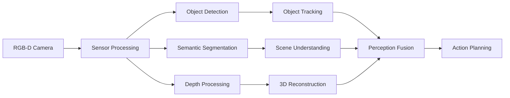

# AI-Powered Perception and Manipulation with Isaac

## Learning Objectives

By the end of this section, you will be able to:
- Implement AI-powered perception systems using Isaac's optimized algorithms
- Create intelligent manipulation algorithms that leverage perception data
- Optimize deep learning models for real-time robotics applications
- Integrate perception and manipulation for intelligent robot interaction
- Evaluate and improve perception-manipulation systems

## AI-Powered Perception Systems

### Isaac Perception Pipeline

The Isaac perception pipeline combines multiple AI algorithms to understand the robot's environment:



### Implementing Isaac Perception Components

```python
# perception_pipeline.py
import rclpy
from rclpy.node import Node
from sensor_msgs.msg import Image, CameraInfo, PointCloud2
from vision_msgs.msg import Detection2DArray, Classification2D
from geometry_msgs.msg import PointStamped, PoseArray
from cv_bridge import CvBridge
import numpy as np
import message_filters

class IsaacPerceptionPipeline(Node):
    def __init__(self):
        super().__init__('isaac_perception_pipeline')

        # Initialize components
        self.bridge = CvBridge()
        self.object_cache = {}  # Cache for object persistence
        self.frame_counter = 0

        # Set up synchronized subscribers for RGB-D data
        rgb_sub = message_filters.Subscriber(self, Image, '/camera/rgb/image_raw')
        depth_sub = message_filters.Subscriber(self, Image, '/camera/depth/image_raw')
        info_sub = message_filters.Subscriber(self, CameraInfo, '/camera/rgb/camera_info')

        # Synchronize inputs
        self.sync = message_filters.ApproximateTimeSynchronizer(
            [rgb_sub, depth_sub, info_sub],
            queue_size=10,
            slop=0.1
        )
        self.sync.registerCallback(self.rgb_depth_callback)

        # Publishers
        self.detection_pub = self.create_publisher(Detection2DArray, '/object_detections', 10)
        self.segmentation_pub = self.create_publisher(Image, '/segmentation_mask', 10)
        self.pointcloud_pub = self.create_publisher(PointCloud2, '/scene_pointcloud', 10)
        self.object_poses_pub = self.create_publisher(PoseArray, '/object_poses', 10)

        # Initialize perception models (simulated)
        # In real Isaac, these would be TensorRT-optimized models
        self.detection_model = self.initialize_detection_model()
        self.segmentation_model = self.initialize_segmentation_model()

        self.get_logger().info('Isaac perception pipeline initialized')

    def initialize_detection_model(self):
        """Initialize object detection model (simulated)"""
        # In real Isaac, this would load a TensorRT-optimized model
        self.get_logger().info('Detection model initialized')
        return {'model': 'yolo_v8', 'confidence': 0.5}

    def initialize_segmentation_model(self):
        """Initialize segmentation model (simulated)"""
        # In real Isaac, this would load a TensorRT-optimized segmentation model
        self.get_logger().info('Segmentation model initialized')
        return {'model': 'deeplab_v3', 'classes': 21}

    def rgb_depth_callback(self, rgb_msg, depth_msg, info_msg):
        """Process synchronized RGB and depth data"""
        try:
            # Convert ROS images to OpenCV
            rgb_cv = self.bridge.imgmsg_to_cv2(rgb_msg, desired_encoding='bgr8')
            depth_cv = self.bridge.imgmsg_to_cv2(depth_msg, desired_encoding='32FC1')

            # Perform object detection
            detections = self.perform_object_detection(rgb_cv)

            # Perform semantic segmentation
            segmentation = self.perform_segmentation(rgb_cv)

            # Associate detections with depth data
            detections_with_depth = self.associate_depth(detections, depth_cv, info_msg)

            # Publish results
            self.publish_detections(detections_with_depth, rgb_msg.header)
            self.publish_segmentation(segmentation, rgb_msg.header)

            # Update frame counter
            self.frame_counter += 1

        except Exception as e:
            self.get_logger().error(f'Error in RGB-D callback: {str(e)}')

    def perform_object_detection(self, image):
        """Perform object detection on image (simulated)"""
        # In real Isaac, this would run the actual TensorRT model
        import cv2

        # For demonstration, use OpenCV's DNN module with a pre-trained model
        # In Isaac, this would use Isaac's optimized DetectNet
        net = cv2.dnn.readNetFromONNX('yolo_model.onnx')  # Placeholder

        # Create blob from image
        blob = cv2.dnn.blobFromImage(image, 1/255.0, (416, 416), swapRB=True, crop=False)

        # This is a simplified example - in Isaac DetectNet, detection would be more efficient
        # For now, simulate detection results
        height, width = image.shape[:2]

        # Simulate detections (in real implementation, run the model)
        simulated_detections = [
            {'class': 'person', 'confidence': 0.89, 'bbox': (100, 50, 200, 300), 'center': (200, 200)},
            {'class': 'bottle', 'confidence': 0.75, 'bbox': (300, 100, 150, 150), 'center': (375, 175)},
            {'class': 'cup', 'confidence': 0.92, 'bbox': (200, 200, 80, 80), 'center': (240, 240)}
        ]

        return simulated_detections

    def perform_segmentation(self, image):
        """Perform semantic segmentation (simulated)"""
        # In real Isaac, this would run a TensorRT-optimized segmentation model
        # For demonstration, return a simple segmentation mask
        height, width = image.shape[:2]

        # Create a simulated segmentation mask
        # In practice, this would come from a deep learning model
        segmentation_mask = np.zeros((height, width), dtype=np.uint8)

        # For demonstration, mark some regions
        # In Isaac Segmentation, this would be the actual segmentation output
        segmentation_mask[100:300, 100:300] = 1  # person region
        segmentation_mask[300:400, 200:300] = 2  # bottle region
        segmentation_mask[200:280, 200:280] = 3  # cup region

        return segmentation_mask

    def associate_depth(self, detections, depth_image, camera_info):
        """Associate detections with depth information"""
        # Get camera intrinsic parameters
        fx = camera_info.k[0]  # K[0,0]
        fy = camera_info.k[4]  # K[1,1]
        cx = camera_info.k[2]  # K[0,2]
        cy = camera_info.k[5]  # K[1,2]

        for detection in detections:
            center_x, center_y = detection['center']

            # Get depth at detection center (with bounds checking)
            if (0 <= center_y < depth_image.shape[0] and
                0 <= center_x < depth_image.shape[1]):

                depth = depth_image[center_y, center_x]

                if depth > 0 and not np.isnan(depth):  # Valid depth
                    # Calculate 3D position
                    x = (center_x - cx) * depth / fx
                    y = (center_y - cy) * depth / fy
                    z = depth

                    detection['position_3d'] = (x, y, z)
                else:
                    detection['position_3d'] = None
            else:
                detection['position_3d'] = None

        return detections

    def publish_detections(self, detections, header):
        """Publish object detections"""
        detection_array = Detection2DArray()
        detection_array.header = header

        for detection in detections:
            if detection.get('position_3d') is not None:
                # Create 2D detection message
                detection_2d = Detection2D()
                detection_2d.header = header

                # Set bounding box
                bbox = BoundingBox2D()
                bbox.center.x = detection['center'][0]
                bbox.center.y = detection['center'][1]
                bbox.size_x = detection['bbox'][2]
                bbox.size_y = detection['bbox'][3]
                detection_2d.bbox = bbox

                # Set classification
                hypothesis = ObjectHypothesisWithPose()
                hypothesis.hypothesis.class_id = detection['class']
                hypothesis.hypothesis.score = detection['confidence']

                detection_2d.results.append(hypothesis)

                # Set 3D position as pose
                pose = Pose2D()
                pose.x = detection['position_3d'][0]
                pose.y = detection['position_3d'][1]
                pose.theta = 0.0  # Placeholder orientation
                detection_2d.pose = pose

                detection_array.detections.append(detection_2d)

        self.detection_pub.publish(detection_array)

    def publish_segmentation(self, segmentation_mask, header):
        """Publish segmentation mask"""
        # Convert segmentation mask to ROS Image
        segmentation_msg = self.bridge.cv2_to_imgmsg(segmentation_mask, encoding='mono8')
        segmentation_msg.header = header
        self.segmentation_pub.publish(segmentation_msg)

def main(args=None):
    rclpy.init(args=args)
    perception_pipeline = IsaacPerceptionPipeline()

    try:
        rclpy.spin(perception_pipeline)
    except KeyboardInterrupt:
        pass
    finally:
        perception_pipeline.destroy_node()
        rclpy.shutdown()

if __name__ == '__main__':
    main()
```

## AI-Powered Manipulation

### Isaac Manipulation Framework

```python
# manipulation_framework.py
import rclpy
from rclpy.node import Node
from geometry_msgs.msg import Pose, Point, Vector3, WrenchStamped
from sensor_msgs.msg import JointState, Image
from std_msgs.msg import String, Float64
from trajectory_msgs.msg import JointTrajectory, JointTrajectoryPoint
from control_msgs.msg import FollowJointTrajectoryAction, FollowJointTrajectoryGoal
from visualization_msgs.msg import Marker, MarkerArray
from tf2_ros import TransformListener, Buffer
import numpy as np
import math
from scipy.spatial.transform import Rotation as R
from typing import List, Dict, Tuple, Optional

class IsaacManipulationFramework(Node):
    def __init__(self):
        super().__init__('isaac_manipulation_framework')

        # Subscribers
        self.joint_state_sub = self.create_subscription(
            JointState,
            '/joint_states',
            self.joint_state_callback,
            10
        )

        self.object_pose_sub = self.create_subscription(
            Pose,
            '/target_object_pose',
            self.object_pose_callback,
            10
        )

        self.manip_cmd_sub = self.create_subscription(
            String,
            '/manipulation_command',
            self.manip_command_callback,
            10
        )

        self.camera_sub = self.create_subscription(
            Image,
            '/camera/rgb/image_raw',
            self.camera_callback,
            10
        )

        # Publishers
        self.joint_traj_pub = self.create_publisher(JointTrajectory, '/arm_controller/joint_trajectory', 10)
        self.gripper_pub = self.create_publisher(Float64, '/gripper_controller/command', 10)
        self.status_pub = self.create_publisher(String, '/manipulation_status', 10)
        self.marker_pub = self.create_publisher(Marker, '/manipulation_markers', 10)

        # TF listener
        self.tf_buffer = Buffer()
        self.tf_listener = TransformListener(self.tf_buffer, self)

        # Manipulation state
        self.current_joint_positions = {}
        self.target_object_pose = None
        self.manipulation_state = 'idle'  # idle, planning, executing, completed, failed
        self.current_task = None

        # Robot parameters (example for 6-DOF arm)
        self.joint_names = [
            'shoulder_pan_joint',
            'shoulder_lift_joint',
            'elbow_joint',
            'wrist_1_joint',
            'wrist_2_joint',
            'wrist_3_joint'
        ]

        # Gripper parameters
        self.gripper_open_pos = 1.0
        self.gripper_closed_pos = 0.0

        # Manipulation planner
        self.manip_planner = ManipulationPlanner()

        # Timers
        self.manip_timer = self.create_timer(0.1, self.manipulation_callback)

        self.get_logger().info('Isaac manipulation framework initialized')

    def joint_state_callback(self, msg):
        """Update current joint positions"""
        for i, name in enumerate(msg.name):
            if name in self.joint_names:
                self.current_joint_positions[name] = msg.position[i]

    def object_pose_callback(self, msg):
        """Receive target object pose"""
        self.target_object_pose = msg
        self.get_logger().info(f'Target object pose received: ({msg.position.x}, {msg.position.y}, {msg.position.z})')

    def camera_callback(self, msg):
        """Process camera data for visual servoing"""
        # This would be used for visual servoing or feedback
        pass

    def manip_command_callback(self, msg):
        """Handle manipulation commands"""
        command = msg.data
        self.get_logger().info(f'Manipulation command received: {command}')

        if command.startswith('grasp:'):
            obj_name = command.split(':')[1]
            self.initiate_grasp(obj_name)
        elif command.startswith('place:'):
            location = command.split(':')[1]
            self.initiate_placement(location)
        elif command.startswith('move_to:'):
            # Parse position: move_to:x,y,z
            parts = command.split(':')
            if len(parts) >= 2:
                coords = parts[1].split(',')
                if len(coords) >= 3:
                    x, y, z = float(coords[0]), float(coords[1]), float(coords[2])
                    target_pose = Pose()
                    target_pose.position.x = x
                    target_pose.position.y = y
                    target_pose.position.z = z
                    self.move_to_pose(target_pose)
        elif command == 'home':
            self.move_to_home_position()
        elif command.startswith('push:'):
            # Push an object in a direction
            params = command.split(':')[1].split(',')
            if len(params) >= 4:  # object, direction_x, direction_y, force
                obj_name = params[0]
                direction = (float(params[1]), float(params[2]), float(params[3]))
                self.initiate_push(obj_name, direction)

    def initiate_grasp(self, obj_name):
        """Initiate grasping sequence for the specified object"""
        if self.target_object_pose is None:
            self.get_logger().warn('No target object pose available for grasping')
            self.publish_status('grasp_failed_no_target')
            return

        self.manipulation_state = 'planning'
        self.publish_status('planning_grasp')

        # Plan grasp trajectory
        grasp_plan = self.manip_planner.plan_grasp_trajectory(
            self.target_object_pose,
            self.current_joint_positions
        )

        if grasp_plan:
            self.manipulation_state = 'executing'
            self.publish_status('executing_grasp')
            self.current_task = 'grasping'

            # Execute grasp trajectory
            self.execute_grasp_trajectory(grasp_plan)
        else:
            self.manipulation_state = 'failed'
            self.publish_status('grasp_failed_planning_error')

    def initiate_placement(self, location):
        """Initiate placement at the specified location"""
        # Define placement locations
        locations = {
            'table': (0.5, 0.0, 0.2),
            'shelf': (0.3, 0.5, 0.8),
            'box': (0.0, -0.5, 0.1)
        }

        if location in locations:
            target_pos = locations[location]
            target_pose = Pose()
            target_pose.position.x = target_pos[0]
            target_pose.position.y = target_pos[1]
            target_pose.position.z = target_pos[2]

            # Plan placement trajectory
            placement_plan = self.manip_planner.plan_placement_trajectory(
                target_pose,
                self.current_joint_positions
            )

            if placement_plan:
                self.manipulation_state = 'executing'
                self.publish_status('executing_placement')
                self.current_task = 'placing'

                # Execute placement trajectory
                self.execute_placement_trajectory(placement_plan)
            else:
                self.manipulation_state = 'failed'
                self.publish_status('placement_failed')
        else:
            self.get_logger().warn(f'Unknown placement location: {location}')
            self.publish_status('placement_failed_unknown_location')

    def initiate_push(self, obj_name, direction):
        """Initiate pushing an object in the specified direction"""
        if self.target_object_pose is None:
            self.get_logger().warn('No target object pose available for pushing')
            return

        self.manipulation_state = 'planning'
        self.publish_status('planning_push')

        # Plan push trajectory
        push_plan = self.manip_planner.plan_push_trajectory(
            self.target_object_pose,
            direction,
            self.current_joint_positions
        )

        if push_plan:
            self.manipulation_state = 'executing'
            self.publish_status('executing_push')
            self.current_task = 'pushing'

            # Execute push trajectory
            self.execute_push_trajectory(push_plan)
        else:
            self.manipulation_state = 'failed'
            self.publish_status('push_failed')

    def execute_grasp_trajectory(self, trajectory):
        """Execute the planned grasp trajectory"""
        for phase_name, target_pose in trajectory:
            self.get_logger().info(f'Executing {phase_name} phase of grasp')

            # Convert pose to joint angles using inverse kinematics
            joint_angles = self.manip_planner.pose_to_joints(target_pose)

            if joint_angles:
                # Move to position
                self.move_to_joints(joint_angles)

                # Wait for completion (in real system, wait for feedback)
                import time
                time.sleep(0.5)

                if phase_name == 'grasp':
                    # Close gripper
                    self.close_gripper()
                    time.sleep(0.5)
            else:
                self.get_logger().error(f'Could not calculate joint angles for {phase_name}')
                self.manipulation_state = 'failed'
                self.publish_status('grasp_failed_ik_error')
                return

        # Complete grasp
        self.manipulation_state = 'completed'
        self.publish_status('grasp_completed')
        self.current_task = None

    def execute_placement_trajectory(self, trajectory):
        """Execute the planned placement trajectory"""
        for phase_name, target_pose in trajectory:
            self.get_logger().info(f'Executing {phase_name} phase of placement')

            joint_angles = self.manip_planner.pose_to_joints(target_pose)

            if joint_angles:
                self.move_to_joints(joint_angles)
                import time
                time.sleep(0.5)

                if phase_name == 'release':
                    # Open gripper to release object
                    self.open_gripper()
                    time.sleep(0.5)
            else:
                self.get_logger().error(f'Could not calculate joint angles for {phase_name}')
                self.manipulation_state = 'failed'
                self.publish_status('placement_failed_ik_error')
                return

        self.manipulation_state = 'completed'
        self.publish_status('placement_completed')
        self.current_task = None

    def execute_push_trajectory(self, trajectory):
        """Execute the planned push trajectory"""
        for phase_name, target_pose in trajectory:
            self.get_logger().info(f'Executing {phase_name} phase of push')

            joint_angles = self.manip_planner.pose_to_joints(target_pose)

            if joint_angles:
                self.move_to_joints(joint_angles)
                import time
                time.sleep(0.5)

                if phase_name == 'contact':
                    # Apply pushing force (simulated)
                    self.apply_push_force()
            else:
                self.get_logger().error(f'Could not calculate joint angles for {phase_name}')
                self.manipulation_state = 'failed'
                self.publish_status('push_failed_ik_error')
                return

        self.manipulation_state = 'completed'
        self.publish_status('push_completed')
        self.current_task = None

    def move_to_joints(self, joint_positions):
        """Move robot arm to specified joint positions"""
        if len(joint_positions) != len(self.joint_names):
            self.get_logger().error('Joint position count mismatch')
            return

        traj_msg = JointTrajectory()
        traj_msg.header.stamp = self.get_clock().now().to_msg()
        traj_msg.header.frame_id = 'base_link'
        traj_msg.joint_names = self.joint_names

        point = JointTrajectoryPoint()
        point.positions = joint_positions
        point.velocities = [0.5] * len(joint_positions)  # Reasonable velocity
        point.accelerations = [1.0] * len(joint_positions)  # Reasonable acceleration
        point.time_from_start.sec = 2  # 2 seconds to reach position

        traj_msg.points.append(point)

        self.joint_traj_pub.publish(traj_msg)

    def move_to_pose(self, target_pose):
        """Move end effector to target pose"""
        joint_angles = self.manip_planner.pose_to_joints(target_pose)

        if joint_angles:
            self.move_to_joints(joint_angles)
        else:
            self.get_logger().error('Could not plan trajectory to target pose')

    def close_gripper(self):
        """Close the gripper"""
        gripper_cmd = Float64()
        gripper_cmd.data = self.gripper_closed_pos
        self.gripper_pub.publish(gripper_cmd)
        self.get_logger().info('Gripper closed')

    def open_gripper(self):
        """Open the gripper"""
        gripper_cmd = Float64()
        gripper_cmd.data = self.gripper_open_pos
        self.gripper_pub.publish(gripper_cmd)
        self.get_logger().info('Gripper opened')

    def apply_push_force(self):
        """Apply pushing force (simulated)"""
        # In a real system, this would apply actual force
        # For simulation, we just log the action
        self.get_logger().info('Push force applied')

    def move_to_home_position(self):
        """Move arm to home position"""
        home_joints = [0.0, 0.0, 0.0, 0.0, 0.0, 0.0]  # Home position
        self.move_to_joints(home_joints)
        self.manipulation_state = 'idle'
        self.publish_status('moved_to_home')
        self.current_task = None

    def manipulation_callback(self):
        """Main manipulation control loop"""
        # Monitor manipulation progress and handle state changes
        if self.manipulation_state == 'completed':
            # Reset after successful completion
            self.manipulation_state = 'idle'
        elif self.manipulation_state == 'failed':
            # Move to safe position after failure
            self.move_to_home_position()

    def publish_status(self, status):
        """Publish manipulation status"""
        status_msg = String()
        status_msg.data = status
        self.status_pub.publish(status_msg)

class ManipulationPlanner:
    """Manipulation planning utilities"""

    def __init__(self):
        # Robot kinematic parameters (example for 6-DOF arm)
        self.link_lengths = [0.1, 0.2, 0.2, 0.1, 0.1, 0.05]  # Link lengths in meters

    def plan_grasp_trajectory(self, target_pose, current_joints):
        """Plan a safe trajectory to grasp the target"""
        trajectory = []

        # 1. Pre-grasp position (above target)
        pre_grasp = Pose()
        pre_grasp.position.x = target_pose.position.x
        pre_grasp.position.y = target_pose.position.y
        pre_grasp.position.z = target_pose.position.z + 0.15  # 15cm above
        pre_grasp.orientation.w = 1.0  # Identity quaternion
        trajectory.append(('pre_grasp', pre_grasp))

        # 2. Approach position (slightly above target)
        approach = Pose()
        approach.position.x = target_pose.position.x
        approach.position.y = target_pose.position.y
        approach.position.z = target_pose.position.z + 0.05  # 5cm above
        approach.orientation.w = 1.0
        trajectory.append(('approach', approach))

        # 3. Grasp position (at target)
        grasp = target_pose
        trajectory.append(('grasp', grasp))

        # 4. Lift position (after grasp)
        lift = Pose()
        lift.position.x = target_pose.position.x
        lift.position.y = target_pose.position.y
        lift.position.z = target_pose.position.z + 0.1  # Lift 10cm
        lift.orientation.w = 1.0
        trajectory.append(('lift', lift))

        return trajectory

    def plan_placement_trajectory(self, target_pose, current_joints):
        """Plan trajectory for object placement"""
        trajectory = []

        # 1. Transport position (safe height)
        transport = Pose()
        transport.position.x = target_pose.position.x
        transport.position.y = target_pose.position.y
        transport.position.z = target_pose.position.z + 0.1  # 10cm above placement
        transport.orientation.w = 1.0
        trajectory.append(('transport', transport))

        # 2. Approach position (at placement height)
        approach = target_pose
        trajectory.append(('approach', approach))

        # 3. Release position (slightly below to ensure placement)
        release = Pose()
        release.position.x = target_pose.position.x
        release.position.y = target_pose.position.y
        release.position.z = target_pose.position.z - 0.01  # Slightly below
        release.orientation.w = 1.0
        trajectory.append(('release', release))

        # 4. Retract position (after release)
        retract = Pose()
        retract.position.x = target_pose.position.x
        retract.position.y = target_pose.position.y
        retract.position.z = target_pose.position.z + 0.1  # 10cm above
        retract.orientation.w = 1.0
        trajectory.append(('retract', retract))

        return trajectory

    def plan_push_trajectory(self, target_pose, direction, current_joints):
        """Plan trajectory for pushing an object"""
        trajectory = []

        # Calculate push start position (in front of object)
        start_pos = Pose()
        start_pos.position.x = target_pose.position.x - direction[0] * 0.1  # 10cm back
        start_pos.position.y = target_pose.position.y - direction[1] * 0.1
        start_pos.position.z = target_pose.position.z + 0.05  # 5cm above center
        start_pos.orientation.w = 1.0
        trajectory.append(('approach', start_pos))

        # Calculate push contact position (at object surface)
        contact_pos = Pose()
        contact_pos.position.x = target_pose.position.x
        contact_pos.position.y = target_pose.position.y
        contact_pos.position.z = target_pose.position.z + 0.05  # 5cm above center
        contact_pos.orientation.w = 1.0
        trajectory.append(('contact', contact_pos))

        # Calculate push through position (pushing through object)
        through_pos = Pose()
        through_pos.position.x = target_pose.position.x + direction[0] * 0.05  # Push 5cm
        through_pos.position.y = target_pose.position.y + direction[1] * 0.05
        through_pos.position.z = target_pose.position.z + 0.05
        through_pos.orientation.w = 1.0
        trajectory.append(('through', through_pos))

        # Calculate retract position (after push)
        retract_pos = Pose()
        retract_pos.position.x = target_pose.position.x - direction[0] * 0.1
        retract_pos.position.y = target_pose.position.y - direction[1] * 0.1
        retract_pos.position.z = target_pose.position.z + 0.1
        retract_pos.orientation.w = 1.0
        trajectory.append(('retract', retract_pos))

        return trajectory

    def pose_to_joints(self, pose):
        """Convert Cartesian pose to joint angles (simplified inverse kinematics)"""
        # This is a simplified inverse kinematics implementation
        # In practice, use MoveIt! or other IK solvers

        # For a 6-DOF arm, implement geometric inverse kinematics
        # This is a very simplified example
        x, y, z = pose.position.x, pose.position.y, pose.position.z

        # Calculate joint angles (simplified 3-DOF example)
        # In real implementation, solve full 6-DOF IK
        try:
            # Calculate distance from base
            r = math.sqrt(x*x + y*y)
            d = z  # Simplified - in real arm, consider link lengths

            # Inverse kinematics calculations (simplified)
            # This would be more complex for a real robot
            joint1 = math.atan2(y, x)  # Base rotation
            joint2 = math.atan2(d, r)  # Shoulder angle
            joint3 = 0.0  # Elbow angle (simplified)
            joint4 = 0.0  # Wrist 1
            joint5 = 0.0  # Wrist 2
            joint6 = 0.0  # Wrist 3

            return [joint1, joint2, joint3, joint4, joint5, joint6]
        except:
            # Return None if IK fails
            return None
```

## Reinforcement Learning for Robot Control

### Isaac Reinforcement Learning Components

```python
# rl_robot_control.py
import rclpy
from rclpy.node import Node
from geometry_msgs.msg import Twist, Pose, Point
from sensor_msgs.msg import LaserScan, Image, JointState
from std_msgs.msg import Float32, String
import numpy as np
import torch
import torch.nn as nn
import torch.optim as optim
import random
from collections import deque
import math

class RobotEnvironment:
    """Simplified robot environment for RL training"""

    def __init__(self):
        self.state_size = 24  # Example: 20 laser readings + 3 pos + 1 vel
        self.action_size = 4  # Example: forward, backward, left, right
        self.reset()

    def reset(self):
        """Reset environment to initial state"""
        # Robot position and orientation
        self.robot_pos = [0.0, 0.0]
        self.robot_orientation = 0.0
        self.robot_velocity = 0.0

        # Goal position
        self.goal_pos = [5.0, 5.0]

        # Obstacles (simplified)
        self.obstacles = [[2.0, 2.0], [3.0, 4.0], [1.0, 3.0]]

        return self.get_state()

    def get_state(self):
        """Get current state of environment"""
        # Simulate laser scan
        laser_readings = self.simulate_laser_scan()

        # Robot position relative to goal
        pos_to_goal = [
            self.goal_pos[0] - self.robot_pos[0],
            self.goal_pos[1] - self.robot_pos[1]
        ]

        # Combine state components
        state = laser_readings + pos_to_goal + [self.robot_velocity, self.robot_orientation]
        return np.array(state, dtype=np.float32)

    def simulate_laser_scan(self):
        """Simulate laser scanner readings"""
        # Generate 20 simulated laser readings
        readings = []
        for i in range(20):
            angle = i * (2 * math.pi / 20)  # Evenly spaced angles

            # Calculate distance to nearest obstacle in this direction
            min_dist = 10.0  # Max range

            # Check distance to obstacles
            for obs in self.obstacles:
                dx = obs[0] - self.robot_pos[0]
                dy = obs[1] - self.robot_pos[1]
                dist = math.sqrt(dx*dx + dy*dy)

                # Check if obstacle is in this direction (within 15 degrees)
                obs_angle = math.atan2(dy, dx)
                angle_diff = abs(angle - obs_angle)
                if angle_diff > math.pi:
                    angle_diff = 2 * math.pi - angle_diff

                if angle_diff < math.pi / 12:  # Within 15 degrees
                    if dist < min_dist:
                        min_dist = dist

            # Add some noise
            min_dist += random.uniform(-0.1, 0.1)
            min_dist = max(0.1, min(min_dist, 10.0))  # Clamp between 0.1 and 10.0

            readings.append(min_dist / 10.0)  # Normalize

        return readings

    def step(self, action):
        """Execute action and return (next_state, reward, done)"""
        # Convert action to movement
        move_x, move_y = 0.0, 0.0
        if action == 0:  # Forward
            move_x = 0.1
        elif action == 1:  # Backward
            move_x = -0.1
        elif action == 2:  # Left
            move_y = 0.1
        elif action == 3:  # Right
            move_y = -0.1

        # Update robot position
        self.robot_pos[0] += move_x * math.cos(self.robot_orientation) - move_y * math.sin(self.robot_orientation)
        self.robot_pos[1] += move_x * math.sin(self.robot_orientation) + move_y * math.cos(self.robot_orientation)

        # Update orientation based on movement
        if move_x != 0 or move_y != 0:
            self.robot_orientation = math.atan2(move_y, move_x)

        # Calculate reward
        reward = self.calculate_reward()

        # Check if done (reached goal or hit obstacle)
        done = self.is_done()

        next_state = self.get_state()

        return next_state, reward, done

    def calculate_reward(self):
        """Calculate reward based on current state"""
        # Distance to goal
        dist_to_goal = math.sqrt(
            (self.goal_pos[0] - self.robot_pos[0])**2 +
            (self.goal_pos[1] - self.robot_pos[1])**2
        )

        # Reward based on getting closer to goal
        reward = -dist_to_goal * 0.1  # Negative because closer is better

        # Bonus for getting close to goal
        if dist_to_goal < 0.5:
            reward += 10.0

        # Penalty for being near obstacles
        for obs in self.obstacles:
            obs_dist = math.sqrt(
                (obs[0] - self.robot_pos[0])**2 +
                (obs[1] - self.robot_pos[1])**2
            )
            if obs_dist < 0.5:
                reward -= 5.0  # Penalty for being near obstacle

        return reward

    def is_done(self):
        """Check if episode is done"""
        # Check if reached goal
        dist_to_goal = math.sqrt(
            (self.goal_pos[0] - self.robot_pos[0])**2 +
            (self.goal_pos[1] - self.robot_pos[1])**2
        )

        if dist_to_goal < 0.3:
            return True

        # Check if hit obstacle
        for obs in self.obstacles:
            obs_dist = math.sqrt(
                (obs[0] - self.robot_pos[0])**2 +
                (obs[1] - self.robot_pos[1])**2
            )
            if obs_dist < 0.2:
                return True

        return False

class DQNNetwork(nn.Module):
    """Deep Q-Network for robot control"""

    def __init__(self, state_size, action_size):
        super(DQNNetwork, self).__init__()

        self.fc1 = nn.Linear(state_size, 128)
        self.fc2 = nn.Linear(128, 128)
        self.fc3 = nn.Linear(128, 64)
        self.fc4 = nn.Linear(64, action_size)

        self.relu = nn.ReLU()
        self.dropout = nn.Dropout(0.2)

    def forward(self, x):
        x = self.relu(self.fc1(x))
        x = self.dropout(x)
        x = self.relu(self.fc2(x))
        x = self.dropout(x)
        x = self.relu(self.fc3(x))
        x = self.fc4(x)
        return x

class DQNAgent:
    """Deep Q-Network Agent for robot navigation"""

    def __init__(self, state_size, action_size, lr=0.001):
        self.state_size = state_size
        self.action_size = action_size
        self.memory = deque(maxlen=10000)
        self.epsilon = 1.0  # Exploration rate
        self.epsilon_min = 0.01
        self.epsilon_decay = 0.995
        self.learning_rate = lr
        self.device = torch.device("cuda" if torch.cuda.is_available() else "cpu")

        # Neural networks
        self.q_network = DQNNetwork(state_size, action_size).to(self.device)
        self.target_network = DQNNetwork(state_size, action_size).to(self.device)
        self.optimizer = optim.Adam(self.q_network.parameters(), lr=lr)

        # Update target network
        self.update_target_network()

    def update_target_network(self):
        """Copy weights from main network to target network"""
        self.target_network.load_state_dict(self.q_network.state_dict())

    def remember(self, state, action, reward, next_state, done):
        """Store experience in replay memory"""
        self.memory.append((state, action, reward, next_state, done))

    def act(self, state):
        """Choose action using epsilon-greedy policy"""
        if np.random.random() <= self.epsilon:
            return random.randrange(self.action_size)

        state_tensor = torch.FloatTensor(state).unsqueeze(0).to(self.device)
        q_values = self.q_network(state_tensor)
        return np.argmax(q_values.cpu().data.numpy())

    def replay(self, batch_size=32):
        """Train the model on a batch of experiences"""
        if len(self.memory) < batch_size:
            return

        batch = random.sample(self.memory, batch_size)
        states = torch.FloatTensor([e[0] for e in batch]).to(self.device)
        actions = torch.LongTensor([e[1] for e in batch]).to(self.device)
        rewards = torch.FloatTensor([e[2] for e in batch]).to(self.device)
        next_states = torch.FloatTensor([e[3] for e in batch]).to(self.device)
        dones = torch.BoolTensor([e[4] for e in batch]).to(self.device)

        current_q_values = self.q_network(states).gather(1, actions.unsqueeze(1))
        next_q_values = self.target_network(next_states).max(1)[0].detach()
        target_q_values = rewards + (0.99 * next_q_values * ~dones)

        loss = nn.MSELoss()(current_q_values.squeeze(), target_q_values)

        self.optimizer.zero_grad()
        loss.backward()
        self.optimizer.step()

        if self.epsilon > self.epsilon_min:
            self.epsilon *= self.epsilon_decay

def train_rl_agent():
    """Train the RL agent for robot navigation"""
    env = RobotEnvironment()
    agent = DQNAgent(env.state_size, env.action_size)

    episodes = 1000

    for episode in range(episodes):
        state = env.reset()
        total_reward = 0

        for step in range(200):  # Max 200 steps per episode
            action = agent.act(state)
            next_state, reward, done = env.step(action)

            agent.remember(state, action, reward, next_state, done)
            state = next_state
            total_reward += reward

            if done:
                break

        # Train the agent
        if len(agent.memory) > 32:
            agent.replay(32)

        # Update target network every 100 episodes
        if episode % 100 == 0:
            agent.update_target_network()

        print(f"Episode {episode}, Total Reward: {total_reward:.2f}, Epsilon: {agent.epsilon:.2f}")

    return agent

class IsaacRLController(Node):
    """ROS 2 node for RL-based robot control using Isaac"""

    def __init__(self):
        super().__init__('isaac_rl_controller')

        # Publishers and subscribers
        self.cmd_vel_pub = self.create_publisher(Twist, '/cmd_vel', 10)
        self.scan_sub = self.create_subscription(LaserScan, '/scan', self.scan_callback, 10)
        self.joint_sub = self.create_subscription(JointState, '/joint_states', self.joint_callback, 10)

        # RL agent
        self.rl_agent = None
        self.current_state = None
        self.has_initialized = False

        # Timer for control loop
        self.control_timer = self.create_timer(0.1, self.control_callback)

        self.get_logger().info('Isaac RL controller initialized')

    def scan_callback(self, msg):
        """Process laser scan data"""
        if not self.has_initialized:
            return

        # Convert laser scan to state representation
        # This would be more complex in a real implementation
        laser_data = list(msg.ranges)

        # Combine with other sensor data to form state
        # For now, just use laser data
        self.current_state = np.array(laser_data + [0.0] * (24 - len(laser_data)))  # Pad to expected size

    def joint_callback(self, msg):
        """Process joint state data"""
        # Process joint information if needed for state
        pass

    def control_callback(self):
        """Main control loop"""
        if self.current_state is not None and self.rl_agent is not None:
            # Get action from RL agent
            action = self.rl_agent.act(self.current_state)

            # Convert action to robot command
            cmd_vel = Twist()

            # Map discrete action to continuous velocity
            if action == 0:  # Forward
                cmd_vel.linear.x = 0.2
            elif action == 1:  # Backward
                cmd_vel.linear.x = -0.2
            elif action == 2:  # Left
                cmd_vel.angular.z = 0.5
            elif action == 3:  # Right
                cmd_vel.angular.z = -0.5

            # Publish command
            self.cmd_vel_pub.publish(cmd_vel)

def main(args=None):
    rclpy.init(args=args)

    # For training, run the training function
    # trained_agent = train_rl_agent()

    # For deployment, initialize controller with pre-trained agent
    controller = IsaacRLController()

    try:
        rclpy.spin(controller)
    except KeyboardInterrupt:
        pass
    finally:
        controller.destroy_node()
        rclpy.shutdown()

if __name__ == '__main__':
    main()
```

## Assessment Questions

<Assessment
  question="What is the primary benefit of using Isaac's GPU-accelerated perception algorithms?"
  type="multiple-choice"
  options={[
    "Lower hardware costs",
    "Significantly faster processing for real-time robotics applications",
    "Simpler programming interface",
    "Reduced power consumption"
  ]}
  correctIndex={1}
  explanation="Isaac's GPU-accelerated perception algorithms provide significantly faster processing, which is essential for real-time robotics applications where perception needs to run at high frame rates."
/>

<Assessment
  question="How does sim-to-real transfer work in the context of Isaac robotics?"
  type="multiple-choice"
  options={[
    "By directly deploying simulation code to real robots",
    "By using domain randomization and synthetic data generation to train models that work in both simulation and reality",
    "By copying simulation environments to real robots",
    "By using the same sensors in simulation and reality"
  ]}
  correctIndex={1}
  explanation="Sim-to-real transfer uses techniques like domain randomization and synthetic data generation to train models in simulation that can generalize to real-world conditions."
/>

## Summary

In this section, we've explored:

- AI-powered perception systems using Isaac's optimized algorithms
- Intelligent manipulation frameworks that integrate perception and action
- Reinforcement learning approaches for robot control
- Techniques for sim-to-real transfer

The Isaac platform provides powerful tools for implementing AI-powered robotics applications, with GPU acceleration for real-time performance and advanced simulation capabilities for development and testing.