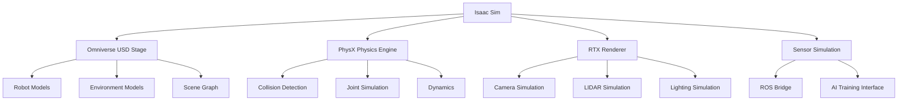

# Introduction to NVIDIA Isaac Platform

## Learning Objectives

By the end of this section, you will be able to:
- Understand the NVIDIA Isaac ecosystem and its key components
- Set up and configure the Isaac development environment
- Use Isaac Sim for robotics simulation and development
- Leverage Isaac's AI capabilities for robotics applications
- Integrate Isaac with ROS 2 for hybrid development workflows

## Introduction to NVIDIA Isaac

NVIDIA Isaac is a comprehensive robotics platform that combines hardware, software, and AI capabilities to accelerate the development of autonomous robots. The platform includes:

- **Isaac Sim**: A high-fidelity simulation environment built on NVIDIA Omniverse
- **Isaac ROS**: Optimized ROS 2 packages accelerated for NVIDIA GPUs
- **Isaac SDK**: Software development kit for robotics applications
- **Isaac Apps**: Reference applications demonstrating robotics capabilities

### Key Benefits of Isaac Platform

1. **GPU Acceleration**: Leverage NVIDIA GPUs for perception, planning, and control
2. **High-Fidelity Simulation**: Accurate physics and sensor simulation
3. **AI Integration**: Built-in support for deep learning and computer vision
4. **ROS 2 Compatibility**: Seamless integration with ROS 2 ecosystem
5. **Hardware Optimization**: Optimized for NVIDIA Jetson and other platforms

## Isaac Sim Overview

Isaac Sim is a robotics simulator built on NVIDIA Omniverse, providing:

- **Photorealistic Rendering**: Physically accurate lighting and materials
- **High-Fidelity Physics**: Accurate simulation of robot dynamics
- **Sensor Simulation**: Realistic camera, LIDAR, IMU, and other sensors
- **AI Training Environment**: Generate synthetic data for training
- **ROS 2 Bridge**: Connect to ROS 2 applications

### Setting Up Isaac Sim

```bash
# Install Isaac Sim prerequisites
# First, ensure NVIDIA drivers are up to date
nvidia-smi

# Install Isaac Sim through Omniverse Launcher
# Download from NVIDIA Developer website
# Install and launch Isaac Sim

# Verify installation
python3 -c "import omni; print('Isaac Sim available')"
```

### Isaac Sim Architecture



## Isaac ROS Integration

Isaac ROS provides GPU-accelerated perception and navigation algorithms:

### Isaac ROS Packages

- **Isaac ROS Visual SLAM**: Visual-inertial SLAM with GPU acceleration
- **Isaac ROS DetectNet**: Object detection with TensorRT optimization
- **Isaac ROS Segmentation**: Semantic segmentation for scene understanding
- **Isaac ROS Point Cloud**: Efficient point cloud processing
- **Isaac ROS Apriltag**: High-performance fiducial detection

### Installing Isaac ROS

```bash
# Install Isaac ROS dependencies
sudo apt update
sudo apt install nvidia-isaac-ros-dev nvidia-isaac-ros-gxf-isaac-dev

# Clone Isaac ROS packages
cd ~/robot_ws/src
git clone https://github.com/NVIDIA-ISAAC-ROS/isaac_ros_common.git
git clone https://github.com/NVIDIA-ISAAC-ROS/isaac_ros_visual_slam.git
git clone https://github.com/NVIDIA-ISAAC-ROS/isaac_ros_detectnet.git
git clone https://github.com/NVIDIA-ISAAC-ROS/isaac_ros_segmentation.git
git clone https://github.com/NVIDIA-ISAAC-ROS/isaac_ros_point_cloud_utils.git

# Build Isaac ROS packages
cd ~/robot_ws
source /opt/ros/humble/setup.bash
colcon build --symlink-install --packages-select \
  isaac_ros_common \
  isaac_ros_visual_slam \
  isaac_ros_detectnet \
  isaac_ros_segmentation \
  isaac_ros_point_cloud_utils
```

## Isaac SDK Components

### Core Components

1. **Engine**: Runtime for executing robotics applications
2. **Applications**: Pre-built robotics applications and workflows
3. **Messages**: Communication framework between components
4. **Codecs**: Data serialization and compression utilities

### Isaac Application Structure

```python
# Example Isaac application structure
import argparse
import json
from isaac import Application, Logger, Message

class IsaacRobotApp(Application):
    def __init__(self):
        super().__init__()
        self.logger = Logger()

    def setup(self):
        """Configure the application"""
        # Load configuration
        self.config = self.load_config("robot_config.json")

        # Create nodes
        self.perception_node = self.create_node("PerceptionNode")
        self.navigation_node = self.create_node("NavigationNode")
        self.control_node = self.create_node("ControlNode")

        # Connect nodes
        self.connect_nodes(self.perception_node, self.navigation_node)
        self.connect_nodes(self.navigation_node, self.control_node)

    def run(self):
        """Main application loop"""
        while not self.should_stop():
            # Process messages
            self.process_messages()

            # Execute nodes
            self.execute_nodes()

            # Sleep to maintain rate
            self.sleep(0.01)  # 10ms

def main():
    parser = argparse.ArgumentParser()
    parser.add_argument("--config", type=str, default="robot_config.json")
    args = parser.parse_args()

    app = IsaacRobotApp()
    app.setup()
    app.run()

if __name__ == "__main__":
    main()
```

## Isaac Sim Programming

### Basic Isaac Sim Application

```python
# basic_isaac_sim.py
import omni
from omni.isaac.core import World
from omni.isaac.core.robots import Robot
from omni.isaac.core.utils.stage import add_reference_to_stage
from omni.isaac.core.utils.nucleus import get_assets_root_path
from omni.isaac.core.utils.prims import get_prim_at_path
from pxr import Gf, UsdGeom, PhysxSchema
import numpy as np

def setup_isaac_sim_world():
    """Set up a basic Isaac Sim world with a robot"""
    # Create world
    world = World(stage_units_in_meters=1.0)

    # Get Isaac Sim assets
    assets_root_path = get_assets_root_path()
    if assets_root_path is None:
        print("Could not find Isaac Sim assets path")
        return None

    # Add a simple robot (using a basic cube for demonstration)
    # In practice, you would use a real robot model
    robot_path = "/World/Robot"
    add_reference_to_stage(
        usd_path=f"{assets_root_path}/Isaac/Robots/Franka/franka.usd",
        prim_path=robot_path
    )

    # Create robot object
    robot = Robot(
        prim_path=robot_path,
        name="franka_robot",
        position=np.array([0.0, 0.0, 0.0]),
        orientation=np.array([1.0, 0.0, 0.0, 0.0])
    )

    # Add robot to world
    world.scene.add(robot)

    # Add ground plane
    world.scene.add_default_ground_plane()

    return world, robot

def main():
    # Set up the world
    result = setup_isaac_sim_world()
    if result is None:
        print("Failed to set up Isaac Sim world")
        return

    world, robot = result

    # Reset the world
    world.reset()

    # Run simulation
    for i in range(500):  # Run for 500 steps
        # Step the world
        world.step(render=True)

        # Print robot position every 50 steps
        if i % 50 == 0:
            position, orientation = robot.get_world_pose()
            print(f"Step {i}: Robot position: {position}")

    print("Isaac Sim demo completed")

if __name__ == "__main__":
    main()
```

## AI-Powered Perception with Isaac

### Using Isaac DetectNet

```python
# isaac_detectnet_example.py
import rclpy
from rclpy.node import Node
from sensor_msgs.msg import Image
from vision_msgs.msg import Detection2DArray, ObjectHypothesisWithPose
from cv_bridge import CvBridge
import numpy as np

class IsaacDetectNetNode(Node):
    def __init__(self):
        super().__init__('isaac_detectnet_node')

        # Initialize CV bridge
        self.bridge = CvBridge()

        # Subscribe to camera image
        self.image_sub = self.create_subscription(
            Image,
            '/camera/image_raw',
            self.image_callback,
            10
        )

        # Publisher for detections
        self.detection_pub = self.create_publisher(
            Detection2DArray,
            '/isaac_detections',
            10
        )

        # Simulated detection model
        # In real Isaac DetectNet, this would be a TensorRT model
        self.get_logger().info('Isaac DetectNet node initialized')

    def image_callback(self, msg):
        """Process camera image and perform object detection"""
        try:
            # Convert ROS Image to OpenCV
            cv_image = self.bridge.imgmsg_to_cv2(msg, desired_encoding='bgr8')

            # Simulate object detection
            # In real Isaac DetectNet, this would run the actual model
            detections = self.simulate_detection(cv_image)

            # Create Detection2DArray message
            detection_array = self.create_detection_message(detections, msg.header)

            # Publish detections
            self.detection_pub.publish(detection_array)

        except Exception as e:
            self.get_logger().error(f'Error processing image: {str(e)}')

    def simulate_detection(self, image):
        """Simulate object detection (replace with actual Isaac DetectNet)"""
        # This is a placeholder - in real Isaac DetectNet,
        # you would run the actual TensorRT model
        import cv2

        # For demonstration, use a simple color-based detection
        hsv = cv2.cvtColor(image, cv2.COLOR_BGR2HSV)

        # Define color ranges for different objects
        color_ranges = {
            'red': (np.array([0, 50, 50]), np.array([10, 255, 255])),
            'blue': (np.array([100, 50, 50]), np.array([130, 255, 255])),
            'green': (np.array([40, 50, 50]), np.array([80, 255, 255]))
        }

        detections = []

        for obj_name, (lower, upper) in color_ranges.items():
            mask = cv2.inRange(hsv, lower, upper)
            contours, _ = cv2.findContours(mask, cv2.RETR_EXTERNAL, cv2.CHAIN_APPROX_SIMPLE)

            for contour in contours:
                area = cv2.contourArea(contour)
                if area > 500:  # Filter small contours
                    x, y, w, h = cv2.boundingRect(contour)

                    detection = {
                        'class': obj_name,
                        'confidence': 0.8,
                        'bbox': (x, y, w, h),
                        'center': (x + w//2, y + h//2)
                    }
                    detections.append(detection)

        return detections

    def create_detection_message(self, detections, header):
        """Create Detection2DArray message from detections"""
        detection_array = Detection2DArray()
        detection_array.header = header

        for detection in detections:
            detection_2d = Detection2D()
            detection_2d.header = header

            # Set bounding box
            bbox = BoundingBox2D()
            bbox.center.x = detection['center'][0]
            bbox.center.y = detection['center'][1]
            bbox.size_x = detection['bbox'][2]
            bbox.size_y = detection['bbox'][3]
            detection_2d.bbox = bbox

            # Set classification
            hypothesis = ObjectHypothesisWithPose()
            hypothesis.hypothesis.class_id = detection['class']
            hypothesis.hypothesis.score = detection['confidence']

            detection_2d.results.append(hypothesis)

            detection_array.detections.append(detection_2d)

        return detection_array

def main(args=None):
    rclpy.init(args=args)
    detectnet_node = IsaacDetectNetNode()

    try:
        rclpy.spin(detectnet_node)
    except KeyboardInterrupt:
        pass
    finally:
        detectnet_node.destroy_node()
        rclpy.shutdown()

if __name__ == '__main__':
    main()
```

## Sim-to-Real Transfer

### Domain Randomization

```python
# domain_randomization.py
import random
import numpy as np

class DomainRandomizer:
    def __init__(self):
        self.randomization_params = {
            'lighting': {
                'intensity_range': (0.5, 2.0),
                'color_temperature_range': (3000, 8000)
            },
            'textures': {
                'roughness_range': (0.0, 1.0),
                'metallic_range': (0.0, 1.0)
            },
            'physics': {
                'friction_range': (0.1, 1.0),
                'restitution_range': (0.0, 0.5)
            }
        }

    def randomize_lighting(self, light_prim):
        """Randomize lighting properties"""
        intensity = random.uniform(
            self.randomization_params['lighting']['intensity_range'][0],
            self.randomization_params['lighting']['intensity_range'][1]
        )

        color_temp = random.uniform(
            self.randomization_params['lighting']['color_temperature_range'][0],
            self.randomization_params['lighting']['color_temperature_range'][1]
        )

        # Apply randomization to light
        # This would modify the light properties in Isaac Sim
        print(f"Randomized lighting: intensity={intensity}, temperature={color_temp}")

    def randomize_materials(self, material_prim):
        """Randomize material properties"""
        roughness = random.uniform(
            self.randomization_params['textures']['roughness_range'][0],
            self.randomization_params['textures']['roughness_range'][1]
        )

        metallic = random.uniform(
            self.randomization_params['textures']['metallic_range'][0],
            self.randomization_params['textures']['metallic_range'][1]
        )

        # Apply randomization to material
        print(f"Randomized material: roughness={roughness}, metallic={metallic}")

    def randomize_physics(self, rigid_body_prim):
        """Randomize physics properties"""
        friction = random.uniform(
            self.randomization_params['physics']['friction_range'][0],
            self.randomization_params['physics']['friction_range'][1]
        )

        restitution = random.uniform(
            self.randomization_params['physics']['restitution_range'][0],
            self.randomization_params['physics']['restitution_range'][1]
        )

        # Apply randomization to physics properties
        print(f"Randomized physics: friction={friction}, restitution={restitution}")
```

## Assessment Questions

<Assessment
  question="What is the primary advantage of using NVIDIA Isaac Sim for robotics development?"
  type="multiple-choice"
  options={[
    "Lower cost of hardware",
    "High-fidelity simulation with GPU acceleration and photorealistic rendering",
    "Simpler programming interface",
    "Reduced need for physical robots"
  ]}
  correctIndex={1}
  explanation="Isaac Sim provides high-fidelity simulation with GPU acceleration, photorealistic rendering, accurate physics, and realistic sensor simulation, which are crucial for developing and testing robotics applications."
/>

<Assessment
  question="How does Isaac ROS differ from standard ROS 2 packages?"
  type="multiple-choice"
  options={[
    "Isaac ROS only works with NVIDIA hardware",
    "Isaac ROS provides GPU-accelerated algorithms optimized for NVIDIA GPUs",
    "Isaac ROS has a different communication protocol",
    "Isaac ROS is only for simulation"
  ]}
  correctIndex={1}
  explanation="Isaac ROS provides GPU-accelerated algorithms that are specifically optimized for NVIDIA GPUs, offering significant performance improvements over standard ROS 2 packages for perception, navigation, and other compute-intensive tasks."
/>

## Summary

The NVIDIA Isaac platform provides a comprehensive solution for robotics development with:

- High-fidelity simulation through Isaac Sim
- GPU-accelerated perception and navigation through Isaac ROS
- Integration with ROS 2 ecosystem
- AI-powered capabilities for perception and control
- Tools for sim-to-real transfer

In the next sections, we'll explore how to implement reinforcement learning for robot control and advanced perception techniques using the Isaac platform.