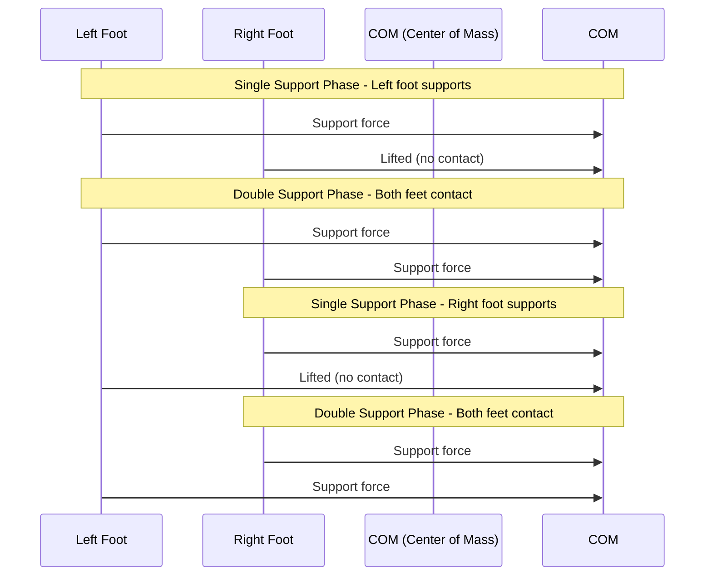

# Bipedal Locomotion and Human-Robot Interaction

## Learning Objectives

By the end of this section, you will be able to:
- Implement stable bipedal locomotion algorithms for humanoid robots
- Design natural and intuitive human-robot interaction systems
- Apply advanced control strategies for walking stability
- Integrate perception systems with locomotion and interaction
- Evaluate and optimize walking and interaction performance

## Introduction to Bipedal Locomotion

Bipedal locomotion is one of the most challenging aspects of humanoid robotics. Unlike wheeled robots, bipedal robots must constantly balance themselves while moving, making walking a complex dynamic process that requires precise control.

### Key Challenges in Bipedal Walking

1. **Dynamic Balance**: Maintaining stability during single and double support phases
2. **Ground Contact**: Managing the transition between feet during walking
3. **Terrain Adaptation**: Handling uneven surfaces and obstacles
4. **Real-time Control**: Computing control commands at high frequencies
5. **Energy Efficiency**: Minimizing power consumption during walking

### Walking Phases

Bipedal walking consists of two main phases:

1. **Single Support Phase**: One foot is in contact with the ground
2. **Double Support Phase**: Both feet are in contact with the ground (during transitions)



## Walking Pattern Generation

### Inverted Pendulum Model

The inverted pendulum model is a fundamental approach to walking pattern generation:

```python
# walking_pattern_generator.py
import numpy as np
import math
from typing import List, Tuple
import matplotlib.pyplot as plt

class InvertedPendulumController:
    """Inverted pendulum model for walking pattern generation"""

    def __init__(self, com_height: float = 0.8, gravity: float = 9.81):
        self.com_height = com_height  # Height of center of mass
        self.gravity = gravity
        self.omega = math.sqrt(gravity / com_height)  # Natural frequency

    def calculate_com_trajectory(self, zmp_trajectory: List[np.ndarray],
                               dt: float = 0.01) -> List[np.ndarray]:
        """
        Calculate COM trajectory from ZMP trajectory using the linear inverted pendulum model
        COM(t) = ZMP(t) + (COM_double_dot(t) * h / g)
        """
        com_trajectory = []
        n_points = len(zmp_trajectory)

        # For simplicity, use a precomputed solution
        # In practice, solve the differential equation: COM_double_dot = g/h * (COM - ZMP)
        for i, zmp in enumerate(zmp_trajectory):
            # Calculate COM position based on ZMP and dynamics
            # This is a simplified implementation
            com_x = zmp[0]
            com_y = zmp[1]
            com_z = self.com_height

            com_trajectory.append(np.array([com_x, com_y, com_z]))

        return com_trajectory

    def generate_swing_foot_trajectory(self, start_pos: np.ndarray, end_pos: np.ndarray,
                                     step_height: float = 0.05, dt: float = 0.01) -> List[np.ndarray]:
        """
        Generate swing foot trajectory using a 5th order polynomial
        """
        # Calculate step parameters
        step_time = 0.8  # 0.8 seconds per step
        n_points = int(step_time / dt)

        # 5th order polynomial for smooth trajectory
        # q(t) = a₀ + a₁*t + a₂*t² + a₃*t³ + a₄*t⁴ + a₅*t⁵
        # With boundary conditions: q(0) = start, q(T) = end, q_dot(0) = 0, q_dot(T) = 0, q_ddot(0) = 0, q_ddot(T) = 0

        trajectory = []
        for i in range(n_points):
            t = i * dt
            T = step_time

            # 5th order polynomial coefficients
            a0 = start_pos
            a1 = np.zeros(3)  # Start velocity = 0
            a2 = np.zeros(3)  # Start acceleration = 0
            a3 = (20 * (end_pos - start_pos) - (8 * np.zeros(3) + 12 * np.zeros(3)) * T - (3 * np.zeros(3) - np.zeros(3)) * T**2) / (2 * T**3)
            a4 = (30 * (start_pos - end_pos) + (14 * np.zeros(3) + 16 * np.zeros(3)) * T + (3 * np.zeros(3) - 2 * np.zeros(3)) * T**2) / (2 * T**4)
            a5 = (12 * (end_pos - start_pos) - (6 * np.zeros(3) + 6 * np.zeros(3)) * T - (np.zeros(3) - np.zeros(3)) * T**2) / (2 * T**5)

            # Calculate position
            t_vec = np.array([t, t, t])
            pos = a0 + a1*t_vec + a2*t_vec**2 + a3*t_vec**3 + a4*t_vec**4 + a5*t_vec**5

            # Add step height profile
            if t < T/2:
                height_factor = 4 * step_height * t * (T/2 - t) / (T/2)**2
            else:
                height_factor = 4 * step_height * (T - t) * (t - T/2) / (T/2)**2

            pos[2] += height_factor  # Add height to z-component

            trajectory.append(pos)

        return trajectory

    def generate_walking_pattern(self, num_steps: int = 10, step_length: float = 0.3,
                               step_width: float = 0.2) -> Tuple[List[np.ndarray], List[np.ndarray]]:
        """
        Generate complete walking pattern: ZMP and foot trajectories
        """
        zmp_trajectory = []
        foot_trajectory = []

        # Start position
        left_foot_pos = np.array([-step_width/2, 0, 0])
        right_foot_pos = np.array([step_width/2, 0, 0])

        # Walking parameters
        step_time = 0.8  # seconds per step
        dt = 0.01  # 100 Hz control
        n_points_per_step = int(step_time / dt)

        for step in range(num_steps):
            # Determine which foot is swing foot
            if step % 2 == 0:  # Left foot is support, right foot swings forward
                support_foot = "left"
                swing_start = right_foot_pos.copy()
                swing_end = np.array([step_width/2, (step+1)*step_length, 0])
            else:  # Right foot is support, left foot swings forward
                support_foot = "right"
                swing_start = left_foot_pos.copy()
                swing_end = np.array([-step_width/2, (step+1)*step_length, 0])

            # Generate swing foot trajectory
            swing_traj = self.generate_swing_foot_trajectory(swing_start, swing_end, 0.05, dt)

            # Generate ZMP trajectory (simplified)
            for i, swing_pos in enumerate(swing_traj):
                # ZMP should be under the support foot during single support
                if support_foot == "left":
                    zmp_pos = np.array([left_foot_pos[0], left_foot_pos[1], 0])
                else:
                    zmp_pos = np.array([right_foot_pos[0], right_foot_pos[1], 0])

                zmp_trajectory.append(zmp_pos)
                foot_trajectory.append(swing_pos)

            # Update support foot position for next step
            if support_foot == "left":
                left_foot_pos = swing_end.copy()
            else:
                right_foot_pos = swing_end.copy()

        return zmp_trajectory, foot_trajectory

class WalkingController:
    """Main walking controller using ZMP-based approach"""

    def __init__(self, com_height: float = 0.8):
        self.com_height = com_height
        self.inverted_pendulum = InvertedPendulumController(com_height)
        self.support_foot = "left"  # Start with left foot support
        self.left_foot_pos = np.array([-0.1, 0, 0])
        self.right_foot_pos = np.array([0.1, 0, 0])
        self.com_pos = np.array([0, 0, com_height])
        self.com_vel = np.zeros(3)
        self.com_acc = np.zeros(3)

    def step_control(self, dt: float = 0.01) -> Tuple[np.ndarray, np.ndarray]:
        """
        Perform one control step for walking
        Returns desired joint positions and ZMP
        """
        # This is a simplified control step
        # In practice, this would involve complex calculations

        # Update COM based on current ZMP and dynamics
        zmp = self.get_current_zmp()
        com_acc = self.calculate_com_acceleration(zmp)

        # Integrate to get new COM state
        self.com_vel += com_acc * dt
        self.com_pos += self.com_vel * dt

        # Calculate desired joint positions using inverse kinematics
        # This would involve solving the inverse kinematics problem
        desired_joints = self.calculate_joint_positions()

        return desired_joints, zmp

    def get_current_zmp(self) -> np.ndarray:
        """
        Get current ZMP based on walking pattern
        """
        # Simplified: ZMP is under support foot
        if self.support_foot == "left":
            return np.array([self.left_foot_pos[0], self.left_foot_pos[1], 0])
        else:
            return np.array([self.right_foot_pos[0], self.right_foot_pos[1], 0])

    def calculate_com_acceleration(self, zmp: np.ndarray) -> np.ndarray:
        """
        Calculate COM acceleration from ZMP using inverted pendulum model
        COM_double_dot = g/h * (COM - ZMP)
        """
        g = 9.81
        h = self.com_height

        acc = np.zeros(3)
        acc[0] = (g/h) * (self.com_pos[0] - zmp[0])
        acc[1] = (g/h) * (self.com_pos[1] - zmp[1])
        acc[2] = 0  # No vertical acceleration in linear inverted pendulum model

        return acc

    def calculate_joint_positions(self) -> np.ndarray:
        """
        Calculate desired joint positions using inverse kinematics
        This is a placeholder implementation
        """
        # This would solve the inverse kinematics to achieve desired COM and foot positions
        # Return 12 joint angles for both legs (6 DOF each)
        return np.zeros(12)

    def update_step_phase(self, current_time: float, step_time: float = 0.8):
        """
        Update which foot is support foot based on time
        """
        step_number = int(current_time / step_time)
        self.support_foot = "left" if step_number % 2 == 0 else "right"

def example_walking_pattern():
    """Example of generating walking patterns"""
    # Initialize walking controller
    walker = InvertedPendulumController(com_height=0.8)

    # Generate walking pattern for 5 steps
    zmp_traj, foot_traj = walker.generate_walking_pattern(num_steps=5, step_length=0.3, step_width=0.2)

    print(f"Generated walking pattern: {len(zmp_traj)} points")
    print(f"Sample ZMP points: {zmp_traj[:5]}")
    print(f"Sample foot trajectory points: {foot_traj[:5]}")

if __name__ == "__main__":
    example_walking_pattern()
```

## Advanced Walking Control

### Capture Point and Walking Stabilization

The capture point is a key concept for walking stabilization:

```python
# walking_stabilization.py
import numpy as np
import math
from typing import List, Tuple

class CapturePointController:
    """Capture point based walking stabilization"""

    def __init__(self, com_height: float = 0.8, gravity: float = 9.81):
        self.com_height = com_height
        self.gravity = gravity
        self.omega = math.sqrt(gravity / com_height)

    def calculate_capture_point(self, com_pos: np.ndarray, com_vel: np.ndarray) -> np.ndarray:
        """
        Calculate capture point: the point where the robot should step to stop
        Capture Point = COM_pos + COM_vel/omega
        """
        capture_point = com_pos + com_vel / self.omega
        capture_point[2] = 0  # Project to ground plane
        return capture_point

    def calculate_stable_foot_position(self, current_com_pos: np.ndarray,
                                     current_com_vel: np.ndarray,
                                     nominal_step_width: float = 0.2) -> np.ndarray:
        """
        Calculate where to place the next foot to maintain stability
        """
        # Calculate capture point
        capture_point = self.calculate_capture_point(current_com_pos, current_com_vel)

        # For stability, place foot near capture point
        # Add some margin for safety
        foot_pos = capture_point.copy()

        # Limit step width to prevent excessive steps
        current_support_pos = np.array([0, current_com_pos[1], 0])  # Simplified
        direction_to_capture = capture_point - current_support_pos
        distance = np.linalg.norm(direction_to_capture[:2])

        if distance > 0.4:  # Max step distance
            # Scale the step to maximum allowed
            direction_to_capture[:2] = direction_to_capture[:2] / distance * 0.4
            foot_pos = current_support_pos + direction_to_capture

        return foot_pos

    def adjust_walking_pattern(self, original_pattern: List[np.ndarray],
                             current_state: Tuple[np.ndarray, np.ndarray],
                             safety_margin: float = 0.05) -> List[np.ndarray]:
        """
        Adjust walking pattern based on current stability
        """
        adjusted_pattern = []
        current_com_pos, current_com_vel = current_state

        for i, original_foot_pos in enumerate(original_pattern):
            # Calculate capture point
            capture_point = self.calculate_capture_point(current_com_pos, current_com_vel)

            # Calculate distance from original foot placement to capture point
            distance_to_capture = np.linalg.norm(original_foot_pos[:2] - capture_point[:2])

            if distance_to_capture > safety_margin:
                # Adjust foot placement to improve stability
                adjusted_foot_pos = self.calculate_stable_foot_position(
                    current_com_pos, current_com_vel
                )
                adjusted_pattern.append(adjusted_foot_pos)
            else:
                # Original placement is stable enough
                adjusted_pattern.append(original_foot_pos)

        return adjusted_pattern

class WalkingStabilizer:
    """Complete walking stabilization system"""

    def __init__(self, com_height: float = 0.8):
        self.com_height = com_height
        self.capture_controller = CapturePointController(com_height)
        self.dcm_controller = DCMController(com_height)
        self.step_adjustment_threshold = 0.05  # meters

    def stabilize_step(self, current_com_state: Tuple[np.ndarray, np.ndarray],
                      target_foot_position: np.ndarray,
                      current_foot_position: np.ndarray) -> np.ndarray:
        """
        Stabilize a step by adjusting foot placement if needed
        """
        current_com_pos, current_com_vel = current_com_state

        # Calculate where the foot should be placed for stability
        stable_foot_pos = self.capture_controller.calculate_stable_foot_position(
            current_com_pos, current_com_vel
        )

        # Calculate distance between target and stable position
        distance_to_stable = np.linalg.norm(target_foot_position[:2] - stable_foot_pos[:2])

        if distance_to_stable > self.step_adjustment_threshold:
            # Adjust foot placement to improve stability
            print(f"Adjusting foot placement for stability: {distance_to_stable:.3f}m off")
            return stable_foot_pos
        else:
            # Target placement is stable enough
            return target_foot_position

    def calculate_balance_feedback(self, current_com_state: Tuple[np.ndarray, np.ndarray],
                                 desired_com_state: Tuple[np.ndarray, np.ndarray]) -> np.ndarray:
        """
        Calculate balance feedback to maintain stability
        """
        current_com_pos, current_com_vel = current_com_state
        desired_com_pos, desired_com_vel = desired_com_state

        # Calculate errors
        pos_error = desired_com_pos - current_com_pos
        vel_error = desired_com_vel - current_com_vel

        # Simple PD controller for balance
        kp = 10.0  # Position gain
        kd = 2.0   # Velocity gain

        feedback = kp * pos_error + kd * vel_error

        return feedback

class DCMController:
    """DCM (Divergent Component of Motion) Controller"""

    def __init__(self, com_height: float = 0.8, gravity: float = 9.81):
        self.com_height = com_height
        self.gravity = gravity
        self.omega = math.sqrt(gravity / com_height)

    def calculate_dcm(self, com_pos: np.ndarray, com_vel: np.ndarray) -> np.ndarray:
        """
        Calculate Divergent Component of Motion
        DCM = COM_pos + COM_vel/omega
        """
        dcm = com_pos + com_vel / self.omega
        dcm[2] = 0  # Project to ground plane
        return dcm

    def calculate_desired_dcm(self, target_pos: np.ndarray) -> np.ndarray:
        """
        Calculate desired DCM to reach target position
        """
        # For steady-state walking, desired DCM is the target position
        desired_dcm = target_pos.copy()
        desired_dcm[2] = 0  # Project to ground plane
        return desired_dcm

    def calculate_feedback_control(self, current_dcm: np.ndarray,
                                 desired_dcm: np.ndarray) -> np.ndarray:
        """
        Calculate feedback control to drive DCM to desired
        """
        error = desired_dcm - current_dcm
        # Simple proportional control
        control_gain = 2.0 * self.omega  # Critical damping
        feedback = control_gain * error
        return feedback

class WholeBodyWalkingController:
    """Whole body controller that coordinates walking and balance"""

    def __init__(self, com_height: float = 0.8):
        self.com_height = com_height
        self.walking_pattern_generator = InvertedPendulumController(com_height)
        self.stabilizer = WalkingStabilizer(com_height)
        self.dcm_controller = DCMController(com_height)

        # Walking parameters
        self.step_length = 0.3
        self.step_width = 0.2
        self.step_height = 0.05
        self.step_time = 0.8

        # Robot state
        self.left_foot_pos = np.array([-self.step_width/2, 0, 0])
        self.right_foot_pos = np.array([self.step_width/2, 0, 0])
        self.com_pos = np.array([0, 0, com_height])
        self.com_vel = np.zeros(3)
        self.com_acc = np.zeros(3)
        self.support_foot = "left"

    def update_walking_state(self, dt: float) -> bool:
        """
        Update walking state based on control cycle
        Returns True if a step transition occurred
        """
        # Update step phase based on time
        current_time = self.get_current_time()
        step_number = int(current_time / self.step_time)
        new_support_foot = "left" if step_number % 2 == 0 else "right"

        step_transitioned = (new_support_foot != self.support_foot)
        self.support_foot = new_support_foot

        return step_transitioned

    def calculate_walking_control(self, dt: float) -> Tuple[np.ndarray, np.ndarray]:
        """
        Calculate complete walking control: joint commands and balance adjustments
        """
        # Get current robot state
        current_state = (self.com_pos, self.com_vel)

        # Generate walking pattern for this cycle
        # In practice, this would be precomputed
        desired_zmp = self.calculate_desired_zmp()
        desired_com = self.calculate_desired_com()

        # Apply stabilization if needed
        balance_feedback = self.stabilizer.calculate_balance_feedback(
            current_state, (desired_com, np.zeros(3))
        )

        # Calculate DCM-based control
        current_dcm = self.dcm_controller.calculate_dcm(self.com_pos, self.com_vel)
        desired_dcm = self.dcm_controller.calculate_desired_dcm(desired_com)
        dcm_feedback = self.dcm_controller.calculate_feedback_control(current_dcm, desired_dcm)

        # Combine feedback terms
        total_feedback = balance_feedback + dcm_feedback

        # Calculate joint commands using inverse kinematics
        # This would solve the whole-body inverse kinematics problem
        joint_commands = self.calculate_joint_commands(
            desired_com, desired_zmp, total_feedback
        )

        return joint_commands, total_feedback

    def calculate_desired_zmp(self) -> np.ndarray:
        """
        Calculate desired ZMP based on walking pattern
        """
        # Simplified: ZMP is under support foot
        if self.support_foot == "left":
            return self.left_foot_pos.copy()
        else:
            return self.right_foot_pos.copy()

    def calculate_desired_com(self) -> np.ndarray:
        """
        Calculate desired COM position for stable walking
        """
        # Follow the walking pattern with appropriate COM height
        desired_com = np.array([0, 0, self.com_height])
        return desired_com

    def calculate_joint_commands(self, desired_com: np.ndarray, desired_zmp: np.ndarray,
                               feedback: np.ndarray) -> np.ndarray:
        """
        Calculate joint commands using whole body control
        This is a simplified implementation
        """
        # In practice, this would solve the whole-body inverse kinematics
        # with constraints for balance, end-effector positions, etc.

        # For now, return a simple joint configuration
        # 12 joints: 6 for left leg, 6 for right leg
        joint_commands = np.zeros(12)

        # Add some basic walking pattern
        phase = (self.get_current_time() / self.step_time) % 2.0
        if self.support_foot == "left":
            # Right leg is swing leg
            joint_commands[6] = 0.1 * math.sin(phase * math.pi)   # Hip yaw
            joint_commands[7] = 0.2 * math.cos(phase * math.pi)   # Hip roll
            joint_commands[8] = 0.1 * math.sin(phase * math.pi * 2)  # Hip pitch
            joint_commands[9] = -0.2 * math.sin(phase * math.pi)  # Knee pitch
            joint_commands[10] = 0.1 * math.cos(phase * math.pi)  # Ankle pitch
            joint_commands[11] = 0.05 * math.sin(phase * math.pi)  # Ankle roll
        else:
            # Left leg is swing leg
            joint_commands[0] = -0.1 * math.sin(phase * math.pi)  # Hip yaw
            joint_commands[1] = -0.2 * math.cos(phase * math.pi)  # Hip roll
            joint_commands[2] = -0.1 * math.sin(phase * math.pi * 2)  # Hip pitch
            joint_commands[3] = 0.2 * math.sin(phase * math.pi)   # Knee pitch
            joint_commands[4] = -0.1 * math.cos(phase * math.pi)  # Ankle pitch
            joint_commands[5] = -0.05 * math.sin(phase * math.pi)  # Ankle roll

        return joint_commands

    def get_current_time(self) -> float:
        """
        Get current simulation/real time
        """
        # In a real implementation, this would come from the system clock
        import time
        return time.time() % 1000  # Simplified for example

def example_walking_control():
    """Example of walking control with stabilization"""
    # Initialize controller
    controller = WholeBodyWalkingController(com_height=0.8)

    # Simulate walking for a few steps
    dt = 0.01  # 100 Hz control
    simulation_time = 0

    for step in range(500):  # 5 seconds of walking
        simulation_time += dt

        # Calculate walking control
        joint_commands, feedback = controller.calculate_walking_control(dt)

        # Update robot state (simplified)
        # In real implementation, this would integrate the robot dynamics
        controller.com_pos[1] += 0.001  # Slow forward progression

        if step % 100 == 0:  # Print every second
            print(f"Time: {simulation_time:.2f}s, Support foot: {controller.support_foot}, "
                  f"Joint commands: {[f'{c:.2f}' for c in joint_commands[:6]]}")

    print("Walking control simulation completed")

if __name__ == "__main__":
    example_walking_control()
```

## Human-Robot Interaction Design

### Natural Interaction Principles

Human-robot interaction (HRI) is crucial for humanoid robots to be effective in human environments. Natural interaction involves:

1. **Multimodal Communication**: Using speech, gesture, and gaze
2. **Social Cues**: Understanding and generating appropriate social behaviors
3. **Adaptive Interaction**: Adjusting to different users and contexts
4. **Safety and Trust**: Ensuring safe and trustworthy interactions

### Implementation of Interaction Systems

```python
# human_robot_interaction.py
import numpy as np
import math
import time
from typing import Dict, List, Tuple, Optional
from dataclasses import dataclass

@dataclass
class UserState:
    """State information about a user in the interaction"""
    id: str
    position: np.ndarray
    orientation: float  # in radians
    engagement_level: float  # 0.0 to 1.0
    attention_direction: np.ndarray  # Unit vector
    interaction_history: List[str]

class SocialAttentionSystem:
    """System to manage attention and engagement with multiple users"""

    def __init__(self, robot_position: np.ndarray = None):
        self.robot_position = robot_position or np.array([0.0, 0.0, 0.0])
        self.users: Dict[str, UserState] = {}
        self.attending_user: Optional[str] = None
        self.attention_threshold = 2.0  # meters
        self.engagement_timeout = 10.0  # seconds

    def detect_user(self, user_id: str, position: np.ndarray) -> bool:
        """Detect a new user in the environment"""
        if user_id not in self.users:
            self.users[user_id] = UserState(
                id=user_id,
                position=position,
                orientation=0.0,
                engagement_level=0.0,
                attention_direction=np.array([1.0, 0.0, 0.0]),
                interaction_history=[]
            )
            return True
        else:
            # Update existing user position
            self.users[user_id].position = position
            return False

    def update_user_orientation(self, user_id: str, orientation: float):
        """Update user orientation (facing direction)"""
        if user_id in self.users:
            self.users[user_id].orientation = orientation

    def update_user_attention(self, user_id: str, attention_direction: np.ndarray):
        """Update user attention direction"""
        if user_id in self.users:
            self.users[user_id].attention_direction = attention_direction / np.linalg.norm(attention_direction)

    def calculate_engagement_level(self, user_id: str) -> float:
        """Calculate engagement level based on proximity and attention"""
        if user_id not in self.users:
            return 0.0

        user = self.users[user_id]

        # Distance-based engagement (closer users are more engaging)
        distance = np.linalg.norm(user.position - self.robot_position)
        distance_factor = max(0.0, 1.0 - distance / self.attention_threshold)

        # Attention-based engagement (users looking at robot are more engaging)
        robot_to_user = (user.position - self.robot_position) / distance
        attention_alignment = np.dot(user.attention_direction, robot_to_user)
        attention_factor = max(0.0, attention_alignment)

        # Calculate engagement
        engagement = distance_factor * attention_factor
        user.engagement_level = engagement

        return engagement

    def select_attention_target(self) -> Optional[str]:
        """Select which user to attend to based on engagement levels"""
        if not self.users:
            return None

        # Calculate engagement for all users
        for user_id in self.users:
            self.calculate_engagement_level(user_id)

        # Find user with highest engagement
        best_user = max(self.users.keys(), key=lambda uid: self.users[uid].engagement_level)

        # Only attend if engagement is above threshold
        if self.users[best_user].engagement_level > 0.3:
            self.attending_user = best_user
            return best_user

        return None

    def get_attention_direction(self) -> np.ndarray:
        """Get the direction the robot should look"""
        if self.attending_user and self.attending_user in self.users:
            target_pos = self.users[self.attending_user].position
            direction = target_pos - self.robot_position
            direction[2] = 0  # Level to ground plane
            return direction / np.linalg.norm(direction)
        else:
            # Look forward if no attending user
            return np.array([1.0, 0.0, 0.0])

class GestureRecognitionSystem:
    """System to recognize and interpret human gestures"""

    def __init__(self):
        self.recognized_gestures = {
            'pointing': self._recognize_pointing,
            'waving': self._recognize_waving,
            'beckoning': self._recognize_beckoning,
            'stop': self._recognize_stop,
            'come_here': self._recognize_come_here
        }
        self.gesture_thresholds = {
            'pointing': 0.8,
            'waving': 0.7,
            'beckoning': 0.75,
            'stop': 0.85,
            'come_here': 0.75
        }

    def recognize_gesture(self, skeleton_data: Dict) -> Tuple[Optional[str], float]:
        """Recognize gesture from skeleton data"""
        best_gesture = None
        best_confidence = 0.0

        for gesture_name, recognizer_func in self.recognized_gestures.items():
            confidence = recognizer_func(skeleton_data)
            if confidence > best_confidence:
                best_confidence = confidence
                best_gesture = gesture_name

        # Only return recognized gesture if confidence is above threshold
        if best_confidence >= self.gesture_thresholds.get(best_gesture, 0.5):
            return best_gesture, best_confidence

        return None, 0.0

    def _recognize_pointing(self, skeleton_data: Dict) -> float:
        """Recognize pointing gesture"""
        # Check if arm is extended forward with index finger pointed
        try:
            # Simplified: check if right arm is extended forward
            right_shoulder = np.array(skeleton_data.get('right_shoulder', [0, 0, 0]))
            right_elbow = np.array(skeleton_data.get('right_elbow', [0, 0, 0]))
            right_wrist = np.array(skeleton_data.get('right_wrist', [0, 0, 0]))

            # Calculate arm vector
            arm_vector = right_wrist - right_shoulder
            arm_length = np.linalg.norm(arm_vector)

            # Check if arm is extended (not folded)
            if arm_length > 0.5:  # Threshold for extended arm
                # Check if wrist is forward of shoulder
                if arm_vector[0] > 0.3:  # Arm pointing forward
                    return min(1.0, arm_length / 0.8)  # Normalize confidence

            return 0.0
        except:
            return 0.0

    def _recognize_waving(self, skeleton_data: Dict) -> float:
        """Recognize waving gesture"""
        try:
            right_shoulder = np.array(skeleton_data.get('right_shoulder', [0, 0, 0]))
            right_elbow = np.array(skeleton_data.get('right_elbow', [0, 0, 0]))
            right_wrist = np.array(skeleton_data.get('right_wrist', [0, 0, 0]))

            # Calculate the movement of the hand
            # This would be compared to previous frames in a real implementation
            # For now, check if arm is raised
            if right_wrist[1] > right_shoulder[1] + 0.2:  # Arm raised above shoulder
                return 0.8

            return 0.0
        except:
            return 0.0

    def _recognize_beckoning(self, skeleton_data: Dict) -> float:
        """Recognize beckoning (come here) gesture"""
        try:
            # Check for bent elbow with hand moving toward body
            right_shoulder = np.array(skeleton_data.get('right_shoulder', [0, 0, 0]))
            right_elbow = np.array(skeleton_data.get('right_elbow', [0, 0, 0]))
            right_wrist = np.array(skeleton_data.get('right_wrist', [0, 0, 0]))

            # Check if elbow is bent and hand is near body
            arm_bent = np.linalg.norm(right_elbow - right_shoulder) + np.linalg.norm(right_wrist - right_elbow) > 1.1 * np.linalg.norm(right_wrist - right_shoulder)

            if arm_bent and right_wrist[0] < right_shoulder[0]:  # Hand in front of body
                return 0.8

            return 0.0
        except:
            return 0.0

    def _recognize_stop(self, skeleton_data: Dict) -> float:
        """Recognize stop gesture (palm facing forward)"""
        try:
            # Check if hand is raised with palm facing forward
            right_shoulder = np.array(skeleton_data.get('right_shoulder', [0, 0, 0]))
            right_wrist = np.array(skeleton_data.get('right_wrist', [0, 0, 0]))

            # Check if arm is raised
            if right_wrist[1] > right_shoulder[1] + 0.3:  # Arm raised
                return 0.9

            return 0.0
        except:
            return 0.0

    def _recognize_come_here(self, skeleton_data: Dict) -> float:
        """Recognize come here gesture"""
        try:
            # Similar to beckoning but with different arm position
            right_shoulder = np.array(skeleton_data.get('right_shoulder', [0, 0, 0]))
            right_elbow = np.array(skeleton_data.get('right_elbow', [0, 0, 0]))
            right_wrist = np.array(skeleton_data.get('right_wrist', [0, 0, 0]))

            # Check if arm is extended sideways
            arm_extended_sideways = abs(right_wrist[1] - right_shoulder[1]) > 0.3

            if arm_extended_sideways:
                return 0.8

            return 0.0
        except:
            return 0.0

class SocialBehaviorEngine:
    """Engine for generating appropriate social behaviors"""

    def __init__(self):
        self.behavior_map = {
            'greeting': self._greeting_behavior,
            'farewell': self._farewell_behavior,
            'attention': self._attention_behavior,
            'acknowledgment': self._acknowledgment_behavior,
            'help': self._help_behavior,
            'direction': self._direction_behavior
        }

    def generate_behavior(self, behavior_type: str, context: Dict) -> Dict:
        """Generate appropriate social behavior"""
        if behavior_type in self.behavior_map:
            return self.behavior_map[behavior_type](context)
        else:
            # Default behavior
            return self._default_behavior(context)

    def _greeting_behavior(self, context: Dict) -> Dict:
        """Generate greeting behavior"""
        return {
            'head_movement': {'pitch': -10, 'yaw': 0},  # Look down slightly
            'gaze_target': context.get('user_position', [1, 0, 0]),
            'gesture': 'wave',
            'speech': "Hello! How can I help you today?",
            'animation': 'friendly_greeting'
        }

    def _farewell_behavior(self, context: Dict) -> Dict:
        """Generate farewell behavior"""
        return {
            'head_movement': {'pitch': -5, 'yaw': 0},  # Bow slightly
            'gaze_target': context.get('user_position', [1, 0, 0]),
            'gesture': 'wave',
            'speech': "Goodbye! Have a great day!",
            'animation': 'polite_farewell'
        }

    def _attention_behavior(self, context: Dict) -> Dict:
        """Generate attention-getting behavior"""
        return {
            'head_movement': {'pitch': 0, 'yaw': 15},  # Turn head slightly
            'gaze_target': context.get('user_position', [1, 0, 0]),
            'gesture': 'raise_hand',
            'speech': "Excuse me!",
            'animation': 'attention_getting'
        }

    def _acknowledgment_behavior(self, context: Dict) -> Dict:
        """Generate acknowledgment behavior"""
        return {
            'head_movement': {'pitch': -15, 'yaw': 0},  # Nod
            'gaze_target': context.get('user_position', [1, 0, 0]),
            'gesture': 'thumbs_up',
            'speech': "I understand.",
            'animation': 'acknowledgment_nod'
        }

    def _help_behavior(self, context: Dict) -> Dict:
        """Generate help-offering behavior"""
        return {
            'head_movement': {'pitch': 0, 'yaw': 0},  # Face user directly
            'gaze_target': context.get('user_position', [1, 0, 0]),
            'gesture': 'open_arms',
            'speech': "How can I assist you?",
            'animation': 'helpful_posture'
        }

    def _direction_behavior(self, context: Dict) -> Dict:
        """Generate direction-giving behavior"""
        target_direction = context.get('target_direction', [1, 0, 0])
        return {
            'head_movement': {'pitch': 0, 'yaw': 0},  # Look toward target
            'gaze_target': np.array(context.get('user_position', [0, 0, 0])) + np.array(target_direction),
            'gesture': 'point',
            'speech': f"The {context.get('target_object', 'object')} is over there.",
            'animation': 'pointing_gesture'
        }

    def _default_behavior(self, context: Dict) -> Dict:
        """Default neutral behavior"""
        return {
            'head_movement': {'pitch': 0, 'yaw': 0},
            'gaze_target': [1, 0, 0],  # Look forward
            'gesture': 'none',
            'speech': "",
            'animation': 'neutral_standing'
        }

class HumanRobotInteractionManager:
    """Main manager for human-robot interaction"""

    def __init__(self, robot_position: np.ndarray = None):
        self.attention_system = SocialAttentionSystem(robot_position)
        self.gesture_recognizer = GestureRecognitionSystem()
        self.behavior_engine = SocialBehaviorEngine()
        self.current_interaction_state = "idle"
        self.interaction_partners = []
        self.last_interaction_time = time.time()

    def process_user_detection(self, user_id: str, position: np.ndarray) -> bool:
        """Process detection of a user"""
        is_new_user = self.attention_system.detect_user(user_id, position)

        if is_new_user:
            # New user detected, consider greeting
            if self.current_interaction_state == "idle":
                self._initiate_greeting(user_id)

        return is_new_user

    def process_gesture(self, user_id: str, skeleton_data: Dict) -> Optional[Tuple[str, float]]:
        """Process a detected gesture from a user"""
        gesture, confidence = self.gesture_recognizer.recognize_gesture(skeleton_data)

        if gesture and confidence > 0.7:
            # Process the gesture
            self._handle_gesture(user_id, gesture, confidence)
            return gesture, confidence

        return None

    def _handle_gesture(self, user_id: str, gesture: str, confidence: float):
        """Handle a recognized gesture"""
        if gesture == 'waving':
            # User is waving, initiate greeting if not already interacting
            if self.current_interaction_state == "idle":
                self._initiate_greeting(user_id)
        elif gesture == 'pointing':
            # User is pointing, look in that direction
            self._respond_to_pointing(user_id)
        elif gesture == 'beckoning':
            # User is beckoning, move toward them
            self._move_toward_user(user_id)
        elif gesture == 'stop':
            # User is signaling stop, pause current action
            self._pause_current_action()
        elif gesture == 'come_here':
            # User wants robot to come, approach them
            self._approach_user(user_id)

    def _initiate_greeting(self, user_id: str):
        """Initiate greeting to a user"""
        user_pos = self.attention_system.users[user_id].position
        context = {'user_position': user_pos}

        behavior = self.behavior_engine.generate_behavior('greeting', context)
        self.current_interaction_state = "greeting"
        self.interaction_partners.append(user_id)

        print(f"Greeting user {user_id}: {behavior['speech']}")

    def _respond_to_pointing(self, user_id: str):
        """Respond to user pointing gesture"""
        # Get the user's attention direction from skeleton data
        # For now, we'll just acknowledge
        context = {'user_position': self.attention_system.users[user_id].position}

        behavior = self.behavior_engine.generate_behavior('acknowledgment', context)
        self.current_interaction_state = "acknowledging"

        print(f"Acknowledging pointing from user {user_id}")

    def _move_toward_user(self, user_id: str):
        """Move toward the user who beckoned"""
        user_pos = self.attention_system.users[user_id].position
        context = {
            'user_position': user_pos,
            'target_direction': user_pos - np.array([0, 0, 0])  # Robot starts at origin
        }

        behavior = self.behavior_engine.generate_behavior('direction', context)
        self.current_interaction_state = "moving_to_user"

        print(f"Moving toward user {user_id}")

    def _pause_current_action(self):
        """Pause current action in response to stop gesture"""
        self.current_interaction_state = "paused"
        print("Pausing current action due to stop gesture")

    def _approach_user(self, user_id: str):
        """Approach the user who signaled 'come here'"""
        user_pos = self.attention_system.users[user_id].position
        context = {'user_position': user_pos}

        behavior = self.behavior_engine.generate_behavior('help', context)
        self.current_interaction_state = "approaching"

        print(f"Approaching user {user_id} in response to come-here gesture")

    def update_attention(self) -> Optional[str]:
        """Update attention to users and return the attended user"""
        attended_user = self.attention_system.select_attention_target()

        # Update robot's attention direction
        attention_dir = self.attention_system.get_attention_direction()

        return attended_user

    def generate_interaction_response(self, user_request: str) -> str:
        """Generate appropriate response to user request"""
        user_request_lower = user_request.lower()

        # Simple rule-based responses
        if any(word in user_request_lower for word in ["hello", "hi", "hey"]):
            return "Hello! How can I help you today?"
        elif any(word in user_request_lower for word in ["how are you", "how do you do"]):
            return "I'm functioning well, thank you for asking!"
        elif any(word in user_request_lower for word in ["what", "how", "where"]):
            return "I can help answer questions. What would you like to know?"
        elif any(word in user_request_lower for word in ["help", "assist"]):
            return "I'm here to help. What do you need assistance with?"
        elif any(word in user_request_lower for word in ["bye", "goodbye", "see you"]):
            return "Goodbye! Feel free to come back if you need help."
        else:
            return "I'm not sure I understand. Could you please rephrase that?"

def example_human_robot_interaction():
    """Example of human-robot interaction"""
    # Initialize interaction manager
    hri_manager = HumanRobotInteractionManager(robot_position=np.array([0, 0, 0]))

    # Simulate user detection
    user1_id = "user_001"
    user1_pos = np.array([1.5, 0.5, 0])
    hri_manager.process_user_detection(user1_id, user1_pos)

    # Simulate gesture recognition
    # Mock skeleton data for waving gesture
    skeleton_data = {
        'right_shoulder': [0, 0.5, 0],
        'right_elbow': [0.2, 0.7, 0],
        'right_wrist': [0.3, 0.9, 0]
    }

    gesture_result = hri_manager.process_gesture(user1_id, skeleton_data)
    if gesture_result:
        gesture, confidence = gesture_result
        print(f"Recognized gesture: {gesture} with confidence: {confidence:.2f}")

    # Update attention
    attended_user = hri_manager.update_attention()
    if attended_user:
        print(f"Attending to user: {attended_user}")

    # Generate response to user request
    user_request = "Hello robot, can you help me?"
    response = hri_manager.generate_interaction_response(user_request)
    print(f"Robot response: {response}")

    print("Human-robot interaction example completed")

if __name__ == "__main__":
    example_human_robot_interaction()
```

## Integration with Perception and Locomotion

### Coordinated Perception-Action Systems

```python
# perception_action_integration.py
import numpy as np
import time
from typing import Dict, List, Tuple
from threading import Thread, Event
import queue

class PerceptionActionCoordinator:
    """Coordinate perception and action systems for integrated behavior"""

    def __init__(self):
        self.perception_queue = queue.Queue()
        self.action_queue = queue.Queue()
        self.stop_event = Event()

        # State tracking
        self.current_task = None
        self.task_queue = queue.Queue()
        self.robot_pose = np.array([0, 0, 0, 0, 0, 0])  # x, y, z, roll, pitch, yaw
        self.target_objects = []
        self.human_interactions = []

    def start_coordination(self):
        """Start the perception-action coordination loop"""
        perception_thread = Thread(target=self._perception_loop)
        action_thread = Thread(target=self._action_loop)

        perception_thread.start()
        action_thread.start()

    def _perception_loop(self):
        """Main perception processing loop"""
        while not self.stop_event.is_set():
            try:
                # Process perception data
                perception_data = self._process_sensors()

                # Detect objects and humans
                objects = self._detect_objects(perception_data)
                humans = self._detect_humans(perception_data)

                # Update world model
                self._update_world_model(objects, humans)

                # Check for new tasks based on perception
                new_tasks = self._generate_tasks_from_perception(objects, humans)
                for task in new_tasks:
                    self.task_queue.put(task)

                time.sleep(0.05)  # 20 Hz processing

            except Exception as e:
                print(f"Perception loop error: {e}")

    def _action_loop(self):
        """Main action execution loop"""
        while not self.stop_event.is_set():
            try:
                # Get next task
                if not self.task_queue.empty():
                    task = self.task_queue.get()
                    self.current_task = task
                    self._execute_task(task)

                time.sleep(0.01)  # 100 Hz control

            except Exception as e:
                print(f"Action loop error: {e}")

    def _process_sensors(self) -> Dict:
        """Process data from all sensors"""
        sensor_data = {}

        # In a real system, this would read from actual sensors
        # For simulation, generate mock data
        sensor_data['rgb'] = np.random.random((480, 640, 3))  # Camera image
        sensor_data['depth'] = np.random.random((480, 640))    # Depth image
        sensor_data['imu'] = np.random.random(6)              # IMU data (acc + gyro)
        sensor_data['joint_positions'] = np.random.random(12)  # Joint angles
        sensor_data['force_torque'] = np.random.random(6)     # Force/torque sensors

        return sensor_data

    def _detect_objects(self, sensor_data: Dict) -> List[Dict]:
        """Detect objects in the environment"""
        # In a real system, this would use computer vision algorithms
        # For simulation, return mock objects
        objects = []

        # Simulate detecting a few objects
        for i in range(3):
            obj = {
                'id': f'object_{i}',
                'type': 'box' if i % 2 == 0 else 'cylinder',
                'position': np.array([i * 0.5 + 0.5, 0, 0.1]),
                'orientation': np.random.random(4),  # Quaternion
                'confidence': np.random.uniform(0.7, 0.95)
            }
            objects.append(obj)

        self.target_objects = objects
        return objects

    def _detect_humans(self, sensor_data: Dict) -> List[Dict]:
        """Detect humans in the environment"""
        humans = []

        # Simulate detecting humans
        for i in range(2):
            human = {
                'id': f'human_{i}',
                'position': np.array([1.0 + i * 0.3, i * 0.5, 0]),
                'orientation': np.random.random(),  # Yaw angle
                'gesture': 'neutral',
                'attention_direction': np.array([1, 0, 0]),
                'engagement': 0.5
            }
            humans.append(human)

        self.human_interactions = humans
        return humans

    def _update_world_model(self, objects: List[Dict], humans: List[Dict]):
        """Update the robot's world model"""
        # Update internal representation of the world
        # This would be used by planning and control systems
        pass

    def _generate_tasks_from_perception(self, objects: List[Dict], humans: List[Dict]) -> List[Dict]:
        """Generate tasks based on perceived environment"""
        tasks = []

        # Check for interaction opportunities
        for human in humans:
            if human['engagement'] > 0.6:
                # Human seems engaged, consider interaction
                task = {
                    'type': 'social_interaction',
                    'target': human['id'],
                    'priority': 1
                }
                tasks.append(task)

        # Check for manipulation opportunities
        for obj in objects:
            if obj['confidence'] > 0.8:
                # High confidence object detection, consider manipulation
                task = {
                    'type': 'object_interaction',
                    'target': obj['id'],
                    'position': obj['position'],
                    'priority': 2
                }
                tasks.append(task)

        return tasks

    def _execute_task(self, task: Dict):
        """Execute a specific task"""
        if task['type'] == 'social_interaction':
            self._execute_social_interaction(task)
        elif task['type'] == 'object_interaction':
            self._execute_object_interaction(task)
        elif task['type'] == 'navigation':
            self._execute_navigation(task)

    def _execute_social_interaction(self, task: Dict):
        """Execute social interaction task"""
        print(f"Interacting with {task['target']}")

        # Move attention to the person
        human = next((h for h in self.human_interactions if h['id'] == task['target']), None)
        if human:
            # Turn towards the person
            direction_to_human = human['position'] - self.robot_pose[:3]
            target_yaw = np.arctan2(direction_to_human[1], direction_to_human[0])

            # Generate appropriate social behavior
            behavior = {
                'head_movement': {'pitch': -10, 'yaw': target_yaw * 180/np.pi},
                'gaze_target': human['position'],
                'gesture': 'wave',
                'speech': "Hello! How can I help you?",
                'animation': 'greeting'
            }

            # Execute behavior
            self._execute_behavior(behavior)

    def _execute_object_interaction(self, task: Dict):
        """Execute object interaction task"""
        print(f"Interacting with object {task['target']}")

        # Navigate to object
        target_pos = task['position']

        # Simple navigation command
        nav_command = {
            'type': 'navigate',
            'target_position': target_pos[:2],  # x, y only
            'orientation': 0  # Face the object
        }

        # Execute navigation
        self._execute_navigation(nav_command)

    def _execute_navigation(self, task: Dict):
        """Execute navigation task"""
        target_pos = task['target_position']
        print(f"Navigating to {target_pos}")

    def _execute_behavior(self, behavior: Dict):
        """Execute a social behavior"""
        # In a real system, this would control the robot's head, arms, etc.
        print(f"Executing behavior: {behavior}")

    def stop_coordination(self):
        """Stop the coordination loops"""
        self.stop_event.set()

class IntegratedHumanoidSystem:
    """Complete integrated system combining walking, interaction, and perception"""

    def __init__(self):
        self.walking_controller = WholeBodyWalkingController(com_height=0.8)
        self.hri_manager = HumanRobotInteractionManager()
        self.coordinator = PerceptionActionCoordinator()

        # System state
        self.system_state = "idle"
        self.operational = True

    def start_system(self):
        """Start the complete integrated system"""
        # Start perception-action coordination
        self.coordinator.start_coordination()

        # Main control loop
        self._main_control_loop()

    def _main_control_loop(self):
        """Main control loop that integrates all subsystems"""
        dt = 0.01  # 100 Hz

        while self.operational:
            start_time = time.time()

            # Update walking control
            if self.system_state == "walking":
                joint_commands, feedback = self.walking_controller.calculate_walking_control(dt)
                # Send commands to robot (simulated)
                print(f"Sending joint commands: {[f'{c:.2f}' for c in joint_commands[:4]]}...")

            # Update human interaction
            attended_user = self.hri_manager.update_attention()
            if attended_user:
                print(f"Attending to user: {attended_user}")

            # Process any new tasks from coordinator
            if not self.coordinator.task_queue.empty():
                task = self.coordinator.task_queue.get()
                self._handle_task(task)

            # Control loop timing
            elapsed = time.time() - start_time
            sleep_time = max(0, dt - elapsed)
            time.sleep(sleep_time)

    def _handle_task(self, task: Dict):
        """Handle a task from the perception system"""
        if task['type'] == 'social_interaction':
            self.system_state = "interacting"
            # Process the interaction
            response = self.hri_manager.generate_interaction_response("Hello")
            print(f"Interaction response: {response}")

            # After interaction, return to walking if needed
            self.system_state = "walking"
        elif task['type'] == 'navigation':
            self.system_state = "navigating"
            # Handle navigation task
            print(f"Navigating to: {task.get('target_position', 'unknown')}")

            # After navigation, return to normal state
            self.system_state = "walking"

    def stop_system(self):
        """Stop the complete system"""
        self.operational = False
        self.coordinator.stop_coordination()

def example_integrated_system():
    """Example of the complete integrated system"""
    print("Starting integrated humanoid system example...")

    # Initialize the system
    system = IntegratedHumanoidSystem()

    # Simulate running for a short time
    import threading
    timer = threading.Timer(5.0, lambda: setattr(system, 'operational', False))
    timer.start()

    try:
        system.start_system()
    except KeyboardInterrupt:
        print("System stopped by user")
    finally:
        system.stop_system()
        print("Integrated system example completed")

if __name__ == "__main__":
    example_integrated_system()
```

## Assessment Questions

<Assessment
  question="What is the primary purpose of the Capture Point in bipedal walking control?"
  type="multiple-choice"
  options={[
    "To determine the robot's walking speed",
    "To calculate where the robot should step to stop safely",
    "To measure the robot's energy consumption",
    "To detect obstacles in the walking path"
  ]}
  correctIndex={1}
  explanation="The Capture Point is the point where the robot should step to stop its motion and maintain balance. It's calculated as COM_pos + COM_vel/omega and is essential for walking stabilization."
/>

<Assessment
  question="Which of the following is NOT a key component of natural human-robot interaction?"
  type="multiple-choice"
  options={[
    "Multimodal communication (speech, gesture, gaze)",
    "Social cues and appropriate behaviors",
    "Completely autonomous operation without human input",
    "Adaptive interaction based on user behavior"
  ]}
  correctIndex={2}
  explanation="Natural human-robot interaction requires engagement with humans through multimodal communication, social cues, and adaptive behavior. Completely autonomous operation without human input is not a component of human-robot interaction."
/>

## Summary

In this section, we've covered:

- Bipedal locomotion algorithms using inverted pendulum models
- Walking pattern generation and stabilization techniques
- Capture point and DCM-based control for walking stability
- Human-robot interaction design principles
- Social attention and gesture recognition systems
- Integration of perception, locomotion, and interaction systems

These concepts enable humanoid robots to walk stably and interact naturally with humans in real-world environments. The integration of these systems is crucial for creating effective and user-friendly humanoid robots.