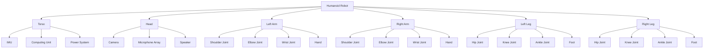

# Humanoid Robot Kinematics and Dynamics

## Learning Objectives

By the end of this section, you will be able to:
- Understand forward and inverse kinematics for humanoid robot systems
- Apply dynamics principles to humanoid robot control
- Implement balance and locomotion algorithms for bipedal robots
- Use kinematic and dynamic models for robot control and simulation
- Analyze and optimize humanoid robot movement patterns

## Introduction to Humanoid Robotics

Humanoid robots are designed to mimic human form and behavior, featuring a torso, head, two arms, and two legs. Developing effective humanoid robots requires understanding complex kinematic and dynamic relationships that govern their movement and interaction with the environment.

### Key Challenges in Humanoid Robotics

1. **Balance Control**: Maintaining stability during locomotion and manipulation
2. **Multi-limb Coordination**: Coordinating arms and legs for complex tasks
3. **Dynamic Locomotion**: Walking, running, and other dynamic movements
4. **Human-like Interaction**: Natural interaction with humans and environments
5. **Real-time Control**: Processing complex computations for real-time control

### Humanoid Robot Architecture



## Forward Kinematics

Forward kinematics calculates the position and orientation of the end-effector (hand or foot) given the joint angles. For humanoid robots, this involves complex kinematic chains for arms and legs.

### Mathematical Foundation

For a kinematic chain with n joints, the position and orientation of the end-effector can be calculated using transformation matrices:

```
T = A₁(θ₁) × A₂(θ₂) × ... × Aₙ(θₙ)
```

Where Aᵢ(θᵢ) is the transformation matrix for joint i.

### Implementation for Humanoid Arms

```python
# forward_kinematics.py
import numpy as np
from math import sin, cos
from typing import List, Tuple

class HumanoidArmKinematics:
    """Forward and inverse kinematics for humanoid arm"""

    def __init__(self, link_lengths: List[float]):
        """
        Initialize arm with link lengths [upper_arm, forearm, hand]
        """
        self.link_lengths = link_lengths

    def dh_transform(self, a: float, alpha: float, d: float, theta: float) -> np.ndarray:
        """
        Denavit-Hartenberg transformation matrix
        """
        return np.array([
            [cos(theta), -sin(theta)*cos(alpha), sin(theta)*sin(alpha), a*cos(theta)],
            [sin(theta), cos(theta)*cos(alpha), -cos(theta)*sin(alpha), a*sin(theta)],
            [0, sin(alpha), cos(alpha), d],
            [0, 0, 0, 1]
        ])

    def forward_kinematics_arm(self, joint_angles: List[float]) -> np.ndarray:
        """
        Calculate forward kinematics for a 6-DOF arm
        Joint angles: [shoulder_yaw, shoulder_pitch, shoulder_roll, elbow_pitch, wrist_yaw, wrist_pitch]
        """
        if len(joint_angles) != 6:
            raise ValueError("Expected 6 joint angles for 6-DOF arm")

        # Simplified model using DH parameters
        # In practice, use the actual robot's DH parameters
        T = np.eye(4)  # Identity transformation

        # Calculate transformation for each joint
        for i, angle in enumerate(joint_angles):
            # Simplified transformation (real robot would have specific DH parameters)
            T_joint = self.get_joint_transform(i, angle)
            T = T @ T_joint

        return T

    def get_joint_transform(self, joint_idx: int, angle: float) -> np.ndarray:
        """
        Get transformation matrix for a specific joint
        This is a simplified example - real robots have specific DH parameters
        """
        # Simplified model for demonstration
        # Real implementation would use actual DH parameters
        if joint_idx == 0:  # Shoulder yaw
            return np.array([
                [cos(angle), -sin(angle), 0, 0],
                [sin(angle), cos(angle), 0, 0],
                [0, 0, 1, 0],
                [0, 0, 0, 1]
            ])
        elif joint_idx == 1:  # Shoulder pitch
            return np.array([
                [cos(angle), 0, sin(angle), 0],
                [0, 1, 0, 0],
                [-sin(angle), 0, cos(angle), self.link_lengths[0]],
                [0, 0, 0, 1]
            ])
        elif joint_idx == 2:  # Shoulder roll
            return np.array([
                [1, 0, 0, 0],
                [0, cos(angle), -sin(angle), 0],
                [0, sin(angle), cos(angle), 0],
                [0, 0, 0, 1]
            ])
        elif joint_idx == 3:  # Elbow pitch
            return np.array([
                [cos(angle), 0, sin(angle), 0],
                [0, 1, 0, 0],
                [-sin(angle), 0, cos(angle), self.link_lengths[1]],
                [0, 0, 0, 1]
            ])
        elif joint_idx == 4:  # Wrist yaw
            return np.array([
                [cos(angle), -sin(angle), 0, 0],
                [sin(angle), cos(angle), 0, 0],
                [0, 0, 1, 0],
                [0, 0, 0, 1]
            ])
        elif joint_idx == 5:  # Wrist pitch
            return np.array([
                [cos(angle), 0, sin(angle), 0],
                [0, 1, 0, 0],
                [-sin(angle), 0, cos(angle), self.link_lengths[2]],
                [0, 0, 0, 1]
            ])
        else:
            return np.eye(4)

    def calculate_end_effector_position(self, joint_angles: List[float]) -> Tuple[float, float, float]:
        """
        Calculate the (x, y, z) position of the end effector
        """
        T = self.forward_kinematics_arm(joint_angles)
        x, y, z = T[0, 3], T[1, 3], T[2, 3]
        return (x, y, z)

class HumanoidLegKinematics:
    """Forward and inverse kinematics for humanoid leg"""

    def __init__(self, link_lengths: List[float]):
        """
        Initialize leg with link lengths [thigh, shank, foot]
        """
        self.link_lengths = link_lengths

    def forward_kinematics_leg(self, joint_angles: List[float]) -> np.ndarray:
        """
        Calculate forward kinematics for a 6-DOF leg
        Joint angles: [hip_yaw, hip_roll, hip_pitch, knee_pitch, ankle_pitch, ankle_roll]
        """
        if len(joint_angles) != 6:
            raise ValueError("Expected 6 joint angles for 6-DOF leg")

        T = np.eye(4)  # Identity transformation

        # Calculate transformation for each joint
        for i, angle in enumerate(joint_angles):
            T_joint = self.get_leg_joint_transform(i, angle)
            T = T @ T_joint

        return T

    def get_leg_joint_transform(self, joint_idx: int, angle: float) -> np.ndarray:
        """
        Get transformation matrix for a specific leg joint
        """
        # Simplified model for demonstration
        if joint_idx == 0:  # Hip yaw
            return np.array([
                [cos(angle), -sin(angle), 0, 0],
                [sin(angle), cos(angle), 0, 0],
                [0, 0, 1, 0],
                [0, 0, 0, 1]
            ])
        elif joint_idx == 1:  # Hip roll
            return np.array([
                [1, 0, 0, 0],
                [0, cos(angle), -sin(angle), 0],
                [0, sin(angle), cos(angle), 0],
                [0, 0, 0, 1]
            ])
        elif joint_idx == 2:  # Hip pitch
            return np.array([
                [cos(angle), 0, sin(angle), 0],
                [0, 1, 0, 0],
                [-sin(angle), 0, cos(angle), self.link_lengths[0]],
                [0, 0, 0, 1]
            ])
        elif joint_idx == 3:  # Knee pitch
            return np.array([
                [cos(angle), 0, sin(angle), 0],
                [0, 1, 0, 0],
                [-sin(angle), 0, cos(angle), self.link_lengths[1]],
                [0, 0, 0, 1]
            ])
        elif joint_idx == 4:  # Ankle pitch
            return np.array([
                [cos(angle), 0, sin(angle), 0],
                [0, 1, 0, 0],
                [-sin(angle), 0, cos(angle), self.link_lengths[2]],
                [0, 0, 0, 1]
            ])
        elif joint_idx == 5:  # Ankle roll
            return np.array([
                [1, 0, 0, 0],
                [0, cos(angle), -sin(angle), 0],
                [0, sin(angle), cos(angle), 0],
                [0, 0, 0, 1]
            ])
        else:
            return np.eye(4)

    def calculate_foot_position(self, joint_angles: List[float]) -> Tuple[float, float, float]:
        """
        Calculate the (x, y, z) position of the foot
        """
        T = self.forward_kinematics_leg(joint_angles)
        x, y, z = T[0, 3], T[1, 3], T[2, 3]
        return (x, y, z)

# Example usage
def example_forward_kinematics():
    """Example of using forward kinematics"""
    # Initialize arm with link lengths (meters)
    arm_kin = HumanoidArmKinematics([0.3, 0.3, 0.1])  # upper_arm, forearm, hand

    # Example joint angles (radians)
    joint_angles = [0.1, 0.2, 0.0, -0.5, 0.1, 0.05]

    # Calculate end effector position
    pos = arm_kin.calculate_end_effector_position(joint_angles)
    print(f"End effector position: ({pos[0]:.3f}, {pos[1]:.3f}, {pos[2]:.3f})")

    # Initialize leg
    leg_kin = HumanoidLegKinematics([0.4, 0.4, 0.1])  # thigh, shank, foot

    # Example leg joint angles
    leg_angles = [0.0, 0.0, 0.0, 0.0, 0.0, 0.0]

    # Calculate foot position
    foot_pos = leg_kin.calculate_foot_position(leg_angles)
    print(f"Foot position: ({foot_pos[0]:.3f}, {foot_pos[1]:.3f}, {foot_pos[2]:.3f})")

if __name__ == "__main__":
    example_forward_kinematics()
```

## Inverse Kinematics

Inverse kinematics calculates the joint angles required to achieve a desired end-effector position and orientation. This is more challenging than forward kinematics and often has multiple solutions or no solution.

### Analytical vs Numerical Methods

1. **Analytical Methods**: Closed-form solutions, fast but limited to specific kinematic structures
2. **Numerical Methods**: Iterative approaches that work for any structure but are computationally intensive

### Implementation for Humanoid Systems

```python
# inverse_kinematics.py
import numpy as np
from scipy.optimize import minimize
from typing import List, Tuple, Optional
import math

class HumanoidInverseKinematics:
    """Inverse kinematics solver for humanoid robots"""

    def __init__(self, arm_lengths: List[float], leg_lengths: List[float]):
        self.arm_lengths = arm_lengths
        self.leg_lengths = leg_lengths

    def jacobian_transpose(self, joint_angles: List[float], end_effector_pos: List[float],
                          target_pos: List[float], alpha: float = 0.01) -> List[float]:
        """
        Calculate joint angle adjustments using Jacobian transpose method
        """
        # Calculate current end effector position
        current_pos = self.forward_kinematics_arm(joint_angles)[:3, 3]

        # Calculate position error
        error = np.array(target_pos) - current_pos

        # Calculate Jacobian matrix
        J = self.calculate_jacobian(joint_angles)

        # Calculate joint adjustments using Jacobian transpose
        delta_theta = alpha * J.T @ error

        # Update joint angles
        new_angles = np.array(joint_angles) + delta_theta

        return new_angles.tolist()

    def calculate_jacobian(self, joint_angles: List[float]) -> np.ndarray:
        """
        Calculate the geometric Jacobian matrix for the arm
        """
        n_joints = len(joint_angles)
        J = np.zeros((3, n_joints))

        # Forward kinematics to get all joint positions
        joint_positions = self.get_joint_positions(joint_angles)

        # End effector position
        end_effector = joint_positions[-1]

        for i in range(n_joints):
            # Calculate the cross product: J[:, i] = z_i × (end_effector - joint_i)
            z_axis = self.get_joint_axis(joint_angles, i)
            r_vector = end_effector - joint_positions[i]

            J[:, i] = np.cross(z_axis, r_vector)

        return J

    def get_joint_positions(self, joint_angles: List[float]) -> List[np.ndarray]:
        """
        Get positions of all joints in the kinematic chain
        """
        positions = []
        T = np.eye(4)

        # This is a simplified implementation
        # In practice, use the full forward kinematics
        current_pos = np.array([0.0, 0.0, 0.0])

        for i, angle in enumerate(joint_angles):
            # Simplified: just add the link length in the appropriate direction
            # based on the joint angle
            if i == 0:  # Shoulder
                current_pos[0] += 0.1 * math.cos(angle)
                current_pos[1] += 0.1 * math.sin(angle)
            elif i == 1:  # Upper arm
                current_pos[0] += self.arm_lengths[0] * math.cos(angle)
                current_pos[2] -= self.arm_lengths[0] * math.sin(angle)
            elif i == 2:  # Forearm
                current_pos[0] += self.arm_lengths[1] * math.cos(angle)
                current_pos[2] -= self.arm_lengths[1] * math.sin(angle)
            # Add more joints as needed

            positions.append(current_pos.copy())

        return positions

    def get_joint_axis(self, joint_angles: List[float], joint_idx: int) -> np.ndarray:
        """
        Get the rotation axis for a specific joint
        """
        # Simplified: return a fixed axis for each joint
        if joint_idx == 0:  # Shoulder yaw
            return np.array([0, 0, 1])
        elif joint_idx == 1:  # Shoulder pitch
            return np.array([0, 1, 0])
        elif joint_idx == 2:  # Shoulder roll
            return np.array([1, 0, 0])
        else:
            return np.array([0, 0, 1])

    def forward_kinematics_arm(self, joint_angles: List[float]) -> np.ndarray:
        """
        Simplified forward kinematics for demonstration
        """
        # This would be replaced with the full forward kinematics implementation
        T = np.eye(4)
        # For demonstration, return a simple transformation
        return T

    def inverse_kinematics_analytical(self, target_pos: List[float],
                                    current_angles: List[float] = None) -> Optional[List[float]]:
        """
        Analytical inverse kinematics solution for a simplified 2D arm
        This is a simplified example for a 2-link planar manipulator
        """
        if len(target_pos) < 2:
            return None

        x, y = target_pos[0], target_pos[1]

        # For a 2-link planar manipulator with lengths l1, l2
        l1 = self.arm_lengths[0]
        l2 = self.arm_lengths[1]

        # Distance from origin to target
        r = math.sqrt(x*x + y*y)

        # Check if target is reachable
        if r > l1 + l2:
            print("Target position is out of reach")
            return None
        elif r < abs(l1 - l2):
            print("Target position is too close")
            return None

        # Calculate joint angles
        try:
            # Angle of second joint
            cos_theta2 = (l1*l1 + l2*l2 - r*r) / (2*l1*l2)
            theta2 = math.acos(max(-1, min(1, cos_theta2)))  # Clamp to valid range

            # Angle of first joint
            k1 = l1 + l2 * math.cos(theta2)
            k2 = l2 * math.sin(theta2)
            theta1 = math.atan2(y, x) - math.atan2(k2, k1)

            return [theta1, theta2, 0, 0, 0, 0]  # Fill remaining joints with 0
        except ValueError:
            print("No solution exists for target position")
            return None

    def inverse_kinematics_numerical(self, target_pos: List[float],
                                   initial_guess: List[float] = None) -> Optional[List[float]]:
        """
        Numerical inverse kinematics using optimization
        """
        def objective_function(joint_angles):
            # Calculate current position from joint angles
            current_pos = self.forward_kinematics_position(joint_angles)

            # Calculate distance to target
            dist = np.sum((np.array(current_pos) - np.array(target_pos))**2)

            # Add joint limit penalties
            joint_limit_penalty = 0
            for i, angle in enumerate(joint_angles):
                if angle < -np.pi or angle > np.pi:
                    joint_limit_penalty += 100  # Large penalty for violating limits

            return dist + joint_limit_penalty

        if initial_guess is None:
            initial_guess = [0.0] * 6  # Default to zero angles

        # Optimize to find joint angles that reach target position
        result = minimize(objective_function, initial_guess, method='BFGS')

        if result.success:
            return result.x.tolist()
        else:
            return None

    def forward_kinematics_position(self, joint_angles: List[float]) -> List[float]:
        """
        Simplified forward kinematics to get end-effector position
        """
        # This is a placeholder implementation
        # In a real system, this would calculate the full forward kinematics
        return [0.0, 0.0, 0.0]

class HumanoidBalanceController:
    """Balance controller for humanoid robots using kinematic and dynamic models"""

    def __init__(self):
        self.com_position = np.array([0.0, 0.0, 0.0])
        self.com_velocity = np.array([0.0, 0.0, 0.0])
        self.com_acceleration = np.array([0.0, 0.0, 0.0])
        self.support_polygon = []
        self.zmp_reference = np.array([0.0, 0.0])

    def calculate_com_position(self, joint_angles: List[float],
                              link_masses: List[float],
                              link_com_positions: List[List[float]]) -> np.ndarray:
        """
        Calculate center of mass position of the robot
        """
        total_mass = sum(link_masses)
        weighted_sum = np.zeros(3)

        # Calculate weighted sum of all link centers of mass
        for mass, com_pos in zip(link_masses, link_com_positions):
            weighted_sum += mass * np.array(com_pos)

        com = weighted_sum / total_mass
        return com

    def calculate_zmp(self, com_pos: np.ndarray, com_acc: np.ndarray,
                     gravity: float = 9.81) -> np.ndarray:
        """
        Calculate Zero Moment Point (ZMP) from COM position and acceleration
        ZMP_x = com_x - (h/g) * com_acc_x
        ZMP_y = com_y - (h/g) * com_acc_y
        where h is the height of the COM
        """
        h = com_pos[2]  # Height of COM
        zmp = np.zeros(2)
        zmp[0] = com_pos[0] - (h / gravity) * com_acc[0]
        zmp[1] = com_pos[1] - (h / gravity) * com_acc[1]

        return zmp

    def is_stable(self, zmp: np.ndarray, support_polygon: List[np.ndarray]) -> bool:
        """
        Check if the robot is stable based on ZMP and support polygon
        """
        # Use the point-in-polygon algorithm to check if ZMP is within support polygon
        return self.point_in_polygon(zmp, support_polygon)

    def point_in_polygon(self, point: np.ndarray, polygon: List[np.ndarray]) -> bool:
        """
        Check if a point is inside a polygon using ray casting algorithm
        """
        x, y = point[0], point[1]
        n = len(polygon)
        inside = False

        p1x, p1y = polygon[0][0], polygon[0][1]
        for i in range(1, n + 1):
            p2x, p2y = polygon[i % n][0], polygon[i % n][1]
            if y > min(p1y, p2y):
                if y <= max(p1y, p2y):
                    if x <= max(p1x, p2x):
                        if p1y != p2y:
                            xinters = (y - p1y) * (p2x - p1x) / (p2y - p1y) + p1x
                        if p1x == p2x or x <= xinters:
                            inside = not inside
            p1x, p1y = p2x, p2y

        return inside

    def balance_control_step(self, current_joint_angles: List[float],
                           desired_com_position: np.ndarray) -> List[float]:
        """
        Perform one step of balance control
        """
        # Calculate current COM position
        # This would use the actual robot model and forward kinematics
        current_com = self.calculate_com_position(
            current_joint_angles,
            [1.0] * len(current_joint_angles),  # Placeholder masses
            [[0.0, 0.0, 0.0]] * len(current_joint_angles)  # Placeholder COM positions
        )

        # Calculate error
        com_error = desired_com_position - current_com

        # Generate corrective joint commands (simplified)
        # In practice, this would use inverse kinematics or whole-body control
        corrective_commands = com_error * 0.1  # Simple proportional control

        # Apply limits and return new joint angles
        new_angles = [a + c for a, c in zip(current_joint_angles, corrective_commands)]

        # Apply joint limits
        new_angles = [max(-1.57, min(1.57, angle)) for angle in new_angles]

        return new_angles

def example_inverse_kinematics():
    """Example of using inverse kinematics"""
    # Initialize inverse kinematics
    ik = HumanoidInverseKinematics([0.3, 0.3, 0.1], [0.4, 0.4, 0.1])

    # Target position
    target_pos = [0.4, 0.2, 0.1]

    # Solve inverse kinematics
    joint_angles = ik.inverse_kinematics_analytical(target_pos)

    if joint_angles:
        print(f"Joint angles to reach {target_pos}: {[f'{a:.3f}' for a in joint_angles]}")
    else:
        print("No solution found for target position")

    # Test balance controller
    balance_ctrl = HumanoidBalanceController()

    # Example support polygon (square foot)
    support_polygon = [
        np.array([-0.1, -0.05]),
        np.array([0.1, -0.05]),
        np.array([0.1, 0.05]),
        np.array([-0.1, 0.05])
    ]

    # Example ZMP
    zmp = np.array([0.02, 0.01])

    is_stable = balance_ctrl.is_stable(zmp, support_polygon)
    print(f"Is robot stable? {is_stable}")

if __name__ == "__main__":
    example_inverse_kinematics()
```

## Humanoid Dynamics

Humanoid dynamics involves understanding the forces and torques required to move the robot's limbs and maintain balance. This includes:

- **Equations of Motion**: Newton-Euler or Lagrangian formulations
- **Centroidal Dynamics**: Dynamics about the center of mass
- **Contact Dynamics**: Interactions with the environment
- **Balance Control**: Maintaining stability during movement

### Implementation of Dynamics Models

```python
# humanoid_dynamics.py
import numpy as np
from typing import List, Tuple
import math

class HumanoidDynamics:
    """Dynamics model for humanoid robots"""

    def __init__(self, link_masses: List[float], link_lengths: List[float]):
        """
        Initialize dynamics model with link properties
        """
        self.link_masses = link_masses
        self.link_lengths = link_lengths
        self.gravity = 9.81

    def rigid_body_dynamics(self, joint_positions: List[float],
                          joint_velocities: List[float],
                          joint_accelerations: List[float],
                          external_forces: List[np.ndarray] = None) -> List[float]:
        """
        Calculate required joint torques using rigid body dynamics
        This uses the recursive Newton-Euler algorithm
        """
        n_joints = len(joint_positions)

        # Initialize arrays
        v = [np.zeros(3) for _ in range(n_joints + 1)]  # Linear velocities
        omega = [np.zeros(3) for _ in range(n_joints + 1)]  # Angular velocities
        a = [np.zeros(3) for _ in range(n_joints + 1)]  # Linear accelerations
        alpha = [np.zeros(3) for _ in range(n_joints + 1)]  # Angular accelerations
        f = [np.zeros(3) for _ in range(n_joints + 1)]  # Forces
        tau = [0.0 for _ in range(n_joints)]  # Torques

        # Forward pass: calculate velocities and accelerations
        # Base acceleration is gravity
        a[0] = np.array([0, 0, -self.gravity])

        for i in range(n_joints):
            # Calculate rotation matrix for joint i
            R = self.get_rotation_matrix(joint_positions[i])

            # Calculate angular velocity
            z_axis = np.array([0, 0, 1])  # Assuming rotation about z-axis
            omega[i+1] = R @ omega[i] + joint_velocities[i] * z_axis

            # Calculate angular acceleration
            alpha[i+1] = R @ alpha[i] + np.cross(omega[i+1], joint_velocities[i] * z_axis) + \
                        joint_accelerations[i] * z_axis

            # Calculate linear velocity of COM
            r = np.array([self.link_lengths[i], 0, 0])  # Position of next joint
            v[i+1] = R @ (v[i] + np.cross(alpha[i], r) + np.cross(omega[i], np.cross(omega[i], r)))

            # Calculate linear acceleration of COM
            a[i+1] = R @ (a[i] + np.cross(alpha[i], r) + np.cross(omega[i], np.cross(omega[i], r)))

        # Backward pass: calculate forces and torques
        for i in range(n_joints - 1, -1, -1):
            # Calculate force at joint i
            m = self.link_masses[i]
            f[i] = m * a[i+1]

            # Calculate torque at joint i
            tau[i] = m * np.dot(np.cross(r, a[i+1]), z_axis)  # Simplified

        return tau

    def get_rotation_matrix(self, angle: float) -> np.ndarray:
        """
        Get 3x3 rotation matrix for a given joint angle
        """
        return np.array([
            [math.cos(angle), -math.sin(angle), 0],
            [math.sin(angle), math.cos(angle), 0],
            [0, 0, 1]
        ])

    def centroidal_momentum_matrix(self, joint_positions: List[float],
                                 joint_velocities: List[float]) -> Tuple[np.ndarray, np.ndarray]:
        """
        Calculate centroidal momentum matrix and its time derivative
        This is used for centroidal dynamics
        """
        # This is a simplified implementation
        # In practice, this would require complex calculations
        # involving the robot's kinematic tree

        # For a simplified example, return a dummy matrix
        # The actual implementation would use the robot's specific kinematics
        n_joints = len(joint_positions)
        n_vars = n_joints + 6  # 6 DOF for base + n joint DOF

        H_c = np.zeros((6, n_vars))  # Centroidal momentum matrix
        H_c_dot = np.zeros((6, n_vars))  # Time derivative

        return H_c, H_c_dot

    def compute_centroidal_dynamics(self, joint_positions: List[float],
                                  joint_velocities: List[float],
                                  joint_accelerations: List[float]) -> Tuple[np.ndarray, np.ndarray]:
        """
        Compute centroidal dynamics: linear and angular momentum
        """
        # Calculate COM position and velocity
        com_pos, com_vel = self.calculate_com_state(joint_positions, joint_velocities)

        # Calculate centroidal momentum
        com_mass = sum(self.link_masses)
        linear_momentum = com_mass * com_vel

        # Calculate angular momentum about COM (simplified)
        angular_momentum = np.zeros(3)

        return linear_momentum, angular_momentum

    def calculate_com_state(self, joint_positions: List[float],
                          joint_velocities: List[float]) -> Tuple[np.ndarray, np.ndarray]:
        """
        Calculate center of mass position and velocity
        """
        total_mass = sum(self.link_masses)

        # Calculate COM position
        com_pos = np.zeros(3)
        for i, (mass, length) in enumerate(zip(self.link_masses, self.link_lengths)):
            # Simplified calculation - in reality, need forward kinematics
            # to get each link's position
            link_pos = self.calculate_link_position(i, joint_positions[:i+1])
            com_pos += mass * link_pos

        com_pos /= total_mass

        # Calculate COM velocity
        com_vel = np.zeros(3)
        for i, (mass, length) in enumerate(zip(self.link_masses, self.link_lengths)):
            link_vel = self.calculate_link_velocity(i, joint_positions[:i+1], joint_velocities[:i+1])
            com_vel += mass * link_vel

        com_vel /= total_mass

        return com_pos, com_vel

    def calculate_link_position(self, link_idx: int, joint_positions: List[float]) -> np.ndarray:
        """
        Calculate position of a specific link using forward kinematics
        """
        # Simplified implementation
        pos = np.zeros(3)

        for i, angle in enumerate(joint_positions):
            if i == 0:  # First joint
                pos[0] += self.link_lengths[i] * math.cos(angle)
                pos[1] += self.link_lengths[i] * math.sin(angle)
            else:
                # Calculate position relative to previous joint
                prev_angle = sum(joint_positions[:i])
                pos[0] += self.link_lengths[i] * math.cos(prev_angle + angle)
                pos[1] += self.link_lengths[i] * math.sin(prev_angle + angle)

        return pos

    def calculate_link_velocity(self, link_idx: int, joint_positions: List[float],
                              joint_velocities: List[float]) -> np.ndarray:
        """
        Calculate velocity of a specific link
        """
        # Simplified implementation using Jacobian
        pos = self.calculate_link_position(link_idx, joint_positions)

        # Calculate Jacobian (simplified)
        J = np.zeros((3, len(joint_positions)))

        # This is a very simplified Jacobian calculation
        # Real implementation would be more complex
        for i in range(len(joint_positions)):
            J[0, i] = -self.link_lengths[i] * math.sin(joint_positions[i])
            J[1, i] = self.link_lengths[i] * math.cos(joint_positions[i])

        # Calculate velocity
        vel = J @ np.array(joint_velocities)

        return vel

class WalkingPatternGenerator:
    """Generate walking patterns for bipedal humanoid robots"""

    def __init__(self, step_height: float = 0.05, step_length: float = 0.3,
                 torso_height: float = 0.8, foot_separation: float = 0.2):
        self.step_height = step_height
        self.step_length = step_length
        self.torso_height = torso_height
        self.foot_separation = foot_separation

    def generate_zmp_trajectory(self, walk_time: float, dt: float = 0.01) -> List[np.ndarray]:
        """
        Generate ZMP trajectory for walking
        """
        steps = int(walk_time / dt)
        zmp_trajectory = []

        # Simplified ZMP trajectory - in reality, this would be more complex
        for i in range(steps):
            t = i * dt

            # Simple ZMP pattern that shifts between feet
            if (t // 1.0) % 2 == 0:  # Left foot support
                zmp_x = 0.0
                zmp_y = self.foot_separation / 2
            else:  # Right foot support
                zmp_x = 0.0
                zmp_y = -self.foot_separation / 2

            # Add forward progression
            zmp_x += (t * 0.1)  # Move forward at 0.1 m/s

            zmp_trajectory.append(np.array([zmp_x, zmp_y]))

        return zmp_trajectory

    def generate_com_trajectory(self, zmp_trajectory: List[np.ndarray],
                              dt: float = 0.01) -> List[np.ndarray]:
        """
        Generate COM trajectory from ZMP trajectory using inverted pendulum model
        """
        com_trajectory = []

        # Use inverted pendulum model: COM = ZMP + (h/g) * COM_double_dot
        # Rearranging: COM_double_dot = (g/h) * (COM - ZMP)

        # For simplicity, use the ZMP trajectory directly with a small offset
        for zmp in zmp_trajectory:
            # Add small offset to maintain stability
            com_pos = np.array([zmp[0], zmp[1], self.torso_height])
            com_trajectory.append(com_pos)

        return com_trajectory

    def generate_joint_trajectory(self, com_trajectory: List[np.ndarray],
                                zmp_trajectory: List[np.ndarray]) -> List[List[float]]:
        """
        Generate joint trajectories from COM and ZMP trajectories
        """
        joint_trajectories = []

        # This is a simplified implementation
        # In practice, this would use inverse kinematics and whole-body control
        for i, (com, zmp) in enumerate(zip(com_trajectory, zmp_trajectory)):
            # Generate simple joint angles based on desired COM and ZMP
            # This is a placeholder implementation
            joint_angles = [0.0] * 12  # 6 DOF per leg

            # Add some variation based on walking phase
            phase = (i * 0.01) % (2 * math.pi)  # Simplified phase

            # Left leg
            joint_angles[0] = 0.1 * math.sin(phase)  # Hip yaw
            joint_angles[1] = 0.2 * math.cos(phase)  # Hip roll
            joint_angles[2] = 0.1 * math.sin(phase * 2)  # Hip pitch
            joint_angles[3] = -0.2 * math.sin(phase)  # Knee pitch
            joint_angles[4] = 0.1 * math.cos(phase)  # Ankle pitch
            joint_angles[5] = 0.05 * math.sin(phase)  # Ankle roll

            # Right leg
            joint_angles[6] = -0.1 * math.sin(phase)  # Hip yaw
            joint_angles[7] = -0.2 * math.cos(phase)  # Hip roll
            joint_angles[8] = -0.1 * math.sin(phase * 2)  # Hip pitch
            joint_angles[9] = 0.2 * math.sin(phase)  # Knee pitch
            joint_angles[10] = -0.1 * math.cos(phase)  # Ankle pitch
            joint_angles[11] = -0.05 * math.sin(phase)  # Ankle roll

            joint_trajectories.append(joint_angles)

        return joint_trajectories

def example_dynamics():
    """Example of using humanoid dynamics"""
    # Initialize dynamics model
    link_masses = [2.0, 1.5, 1.0, 1.0, 0.5]  # Example masses for arm links
    link_lengths = [0.3, 0.3, 0.05, 0.05, 0.02]  # Example lengths
    dynamics = HumanoidDynamics(link_masses, link_lengths)

    # Example joint states
    joint_positions = [0.1, 0.2, 0.0, -0.5, 0.1]
    joint_velocities = [0.05, 0.02, 0.01, -0.03, 0.02]
    joint_accelerations = [0.01, 0.01, 0.005, -0.01, 0.005]

    # Calculate required joint torques
    torques = dynamics.rigid_body_dynamics(joint_positions, joint_velocities, joint_accelerations)
    print(f"Required joint torques: {[f'{t:.3f}' for t in torques]}")

    # Test walking pattern generation
    walker = WalkingPatternGenerator()

    # Generate ZMP trajectory for 2 seconds of walking
    zmp_traj = walker.generate_zmp_trajectory(2.0, 0.01)
    print(f"Generated {len(zmp_traj)} ZMP points")

    # Generate COM trajectory
    com_traj = walker.generate_com_trajectory(zmp_traj[:100])  # Use first 100 points
    print(f"Generated {len(com_traj)} COM points")

    # Generate joint trajectories
    joint_traj = walker.generate_joint_trajectory(com_traj, zmp_traj[:100])
    print(f"Generated {len(joint_traj)} joint trajectory points")

if __name__ == "__main__":
    example_dynamics()
```

## Assessment Questions

<Assessment
  question="What is the primary challenge in solving inverse kinematics for humanoid robots?"
  type="multiple-choice"
  options={[
    "The calculations are too simple to be useful",
    "There may be multiple solutions or no solution, and it's computationally intensive",
    "Forward kinematics is more important than inverse kinematics",
    "Inverse kinematics doesn't work for robots with more than 3 joints"
  ]}
  correctIndex={1}
  explanation="Inverse kinematics for humanoid robots is challenging because there may be multiple valid solutions or no solution at all, and the calculations are computationally intensive, especially for robots with many degrees of freedom."
/>

<Assessment
  question="What does ZMP (Zero Moment Point) represent in humanoid robotics?"
  type="multiple-choice"
  options={[
    "The point where the robot's weight is zero",
    "The point where the net moment of the ground reaction force is zero",
    "The center of mass of the robot",
    "The point where the robot touches the ground"
  ]}
  correctIndex={1}
  explanation="ZMP (Zero Moment Point) is the point on the ground where the net moment of the ground reaction force is zero. It's a key concept for balance control in humanoid robots."
/>

## Summary

In this section, we've covered:

- Forward and inverse kinematics for humanoid robots
- Dynamics modeling for force and torque calculations
- Balance control using center of mass and ZMP concepts
- Walking pattern generation for bipedal locomotion

These concepts form the foundation for controlling complex humanoid robots and enable them to perform stable locomotion and manipulation tasks. Understanding both kinematics and dynamics is crucial for developing effective humanoid robot controllers.